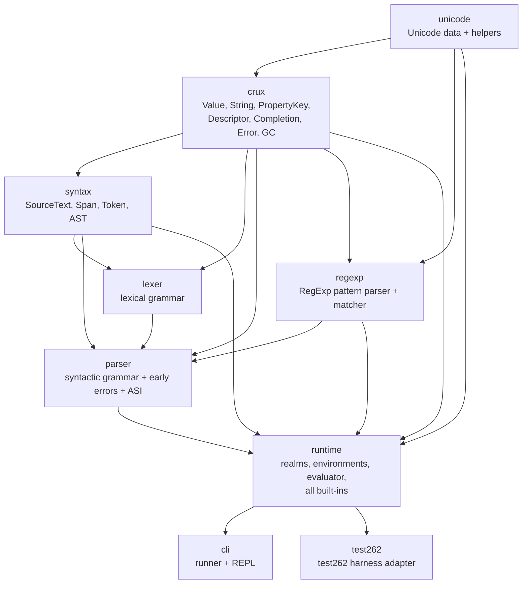

# slag — JavaScript Runtime: Implementation Plan

**Target:** a from-scratch, spec-faithful JavaScript engine in Rust that implements the complete
ECMAScript® 2026 Language Specification (17th edition), as captured in [`spec.html`](spec.html).
**Goal state:** a `cargo` workspace whose members live under `crates/`, able to parse and execute
arbitrary ES2026 source, pass the vast majority of the official `test262` conformance suite, and
expose a small embedding API plus a CLI/REPL.

This plan is written chapter-by-chapter against `spec.html`. Phase numbers below are an
engineering order, **not** the spec chapter order; each phase lists the spec sections it consumes.

---

## 1. Mission

Build a JavaScript engine in Rust that is:

1. **Complete** — covers every normative part of ES2026: lexical grammar, syntactic grammar, all
   early errors, all runtime semantics, all standard built-in objects, proxies, modules, async
   control flow, and (eventually) the shared-memory model.
2. **Spec-faithful** — implementation follows the spec's abstract operations and algorithms
   closely (same names, same ordering, same edge cases), so conformance bugs are easy to find by
   diffing against `spec.html`.
3. **Tested** — every phase ships with unit tests, and the project tracks `test262` pass rates as
   its primary correctness metric.
4. **Usable** — a `slag` CLI (script runner + REPL) and a `runtime::Context` embedding API.

## 2. Scope and non-goals

**In scope**

- All of ECMA-262 (2026): chapters 1–28 of `spec.html`, including Annex B legacy behaviors,
  explicit resource management (`using` / `await using`, `DisposableStack`, `AsyncDisposableStack`,
  `SuppressedError`), the full standard library (including ES2026 additions: `Math.sumPrecise`,
  `Iterator.concat`, `Array.fromAsync`, `Error.isError`, `Map`/`WeakMap` `getOrInsert(Computed)`,
  `Uint8Array` hex/base64 methods, `JSON.parse` reviver contexts, `JSON.rawJSON`/`JSON.isRawJSON`,
  `RegExp.escape`, RegExp modifiers, `Promise.try`, `Float16Array`, resizable/transferable buffers,
  `Atomics.waitAsync`, etc.).

**Non-goals (explicitly deferred or out of scope)**

- **ECMA-402 (Intl)** — not part of `spec.html`. Locale-sensitive methods (`toLocaleString`,
  `toLocaleLowerCase`, `localeCompare`, …) are implemented per the "no Intl" behavior the spec
  permits (usually identity with their non-locale counterparts). A later `slag-intl` crate could
  add Intl on top.
- **Host environments** — no DOM, no Node APIs. Host facilities (`console`, timers, file I/O,
  `import()` resolution, `import.meta`) arrive through a `HostCallbacks`/`HostHooks` embedding API.
- **JIT compilation** — a JIT is a possible long-term performance milestone but is explicitly out
  of scope for correctness work.
- **Multi-agent execution** — a single-threaded agent (one Realm, one job queue) is the default;
  the ch. 27 memory model is implemented as a scoped milestone (Phase 17) behind a worker/thread
  API.

## 3. Workspace and crate layout

Everything lives under `crates/`. Dependency direction is strictly downward; there are no cycles.



| Crate | Responsibility | Spec chapters |
|---|---|---|
| `unicode` | Code-point tables and helpers: WhiteSpace, LineTerminator, ID_Start/ID_Continue, case conversion (Default Case Conversion), normalization data, code-point properties for `\p{…}` escapes | ch. 11–12, 21–22 |
| `crux` | `Value`, `JsString`, `PropertyKey`, `Symbol`, `BigInt`, `PropertyDescriptor`, `Completion`, error types, GC handles/heap, number-to-string/string-to-number | ch. 6, 7 (shared ops) |
| `syntax` | `SourceText` (UTF-16), `Span`, `Token`, the full AST (parse nodes with spans) | ch. 12–16 syntax |
| `lexer` | Tokenizer: all lexical goals, comments, literals, ASI input handling | ch. 11–12 |
| `parser` | Recursive-descent parser, cover-grammar desugaring, all early errors, ASI | ch. 13–17 |
| `regexp` | RegExp pattern parser (per `u`/`v` flags) + backtracking matcher; used both for literal early errors and at runtime | ch. 21 (RegExp), 12 |
| `runtime` | Realms, environment records, execution contexts, job queue, evaluator (tree-walker → bytecode), module linking, all built-ins (ch. 18–26), Annex B | ch. 9–10, 13–26 |
| `cli` | `slag file.js`, REPL, flags (`--dump-ast`, `--dump-tokens`, `--stack-size`, …) | — |
| `test262` | test262 runner + harness files | — |

## 4. Core design decisions

These decisions are fixed up front because they ripple through every crate. Alternatives are noted
where a later change is planned.

### 4.1 Value representation

```rust
pub enum Value {
    Undefined,
    Null,
    Boolean(bool),
    Number(f64),                       // IEEE-754 binary64, incl. -0.0 and NaN
    BigInt(Handle<BigInt>),            // arbitrary precision (num-bigint)
    String(Handle<JsString>),          // UTF-16 code-unit sequence
    Symbol(Handle<Symbol>),            // unique or registered
    Object(Handle<JsObject>),          // all object types
}
```

- `Number` is `f64` and must preserve `-0.0` and NaN (Rust does). NaN payload is not observable per
  spec, so no care is needed beyond not normalizing.
- **Milestone:** NaN-boxing `Value` as a `u64` is a pure representation change behind the same
  public API; planned in the performance workstream (Phase 18), never before correctness is locked.

### 4.2 Strings and property keys

- `JsString` is a flat `Box<[u16]>` (JS strings are sequences of 16-bit code units). A Latin-1 fast
  path (`repr` enum) is a later optimization; correctness work always operates on code units and
  handles lone surrogates explicitly.
- A global string interner in `crux` hash-conses strings; `AtomId(u32)` is used for
  identifiers, property names, and keywords so equality is O(1) and hashing is cheap.
- `PropertyKey` is either an interned string or a `Symbol` handle:

  ```rust
  pub enum PropertyKey { String(AtomId), Symbol(Handle<Symbol>) }
  ```

- All string algorithms from ch. 6 (`StringValueOf`, `CodePointAt`, `StringToCodePoints`,
  `CodePointsToString`, `UTF16SurrogatePairToCodePoint`, …) live on `JsString`/`crux` helpers.

### 4.3 Objects and GC

- One `JsObject` struct for ordinary objects (property map, internal slots) with an `ExoticKind`
  enum for the exotic behaviors (Array, String, Arguments, IntegerIndexed, BoundFunction, Proxy,
  ModuleNamespace):

  ```rust
  pub struct JsObject {
      pub kind: ObjectKind,              // Ordinary | Array | Proxy | ... 
      pub prototype: Option<Handle<JsObject>>,
      pub extensible: bool,
      pub properties: PropertyMap,       // insertion-ordered; integer-index fast path
      pub internal_slots: Slots,         // boxed map of spec [[Slots]]
  }
  ```

  Internal methods are implemented as free functions (`ordinary_get`, `ordinary_set`, …) plus a
  `dispatch` layer that routes to exotic implementations, mirroring the spec's "delegate to
  similarly named abstract operation" pattern. Insertion order is required by the spec
  (`[[OwnPropertyKeys]]` ordering), so `PropertyMap` is `IndexMap`-like with an integer-index fast
  path.

- **GC strategy (phased):**
  1. **Phase 1–early:** `Handle<T> = Rc<T>` and interior mutability via `RefCell`. Object cycles
     leak; this is acceptable while correctness work is happening, and is *documented* as a
     known limitation (WeakMap/WeakSet/FinalizationRegistry semantics will be incomplete).
  2. **GC milestone (Phase 18 workstream):** replace `Rc` with an arena heap (`Vec<ObjectCell>` +
     free list) and a mark-sweep collector tracing roots: the execution context stack, Realm,
     global environment, job queue, module records, and pending Promise reactions. This unlocks
     faithful `WeakRef`, `FinalizationRegistry`, `WeakMap`/`WeakSet` (ephemerons), and bounded
     memory. The `Handle<T>` API is kept so the swap is mostly internal.
  3. When network access is available, evaluate existing crates (`gc`, `broom`) before committing
     to a custom collector; the arena design above works with or without them.

### 4.4 Completion / abrupt-completion model

The spec's *Completion* concept maps to two Rust result types:

```rust
// Expression evaluation: only normal values or thrown errors.
type EvalResult = Result<Value, JsError>;

// Statement evaluation: also return / break / continue.
pub enum Flow {
    Normal,
    Break(Option<AtomId>),
    Continue(Option<AtomId>),
    Return(Value),
}
type StmtResult = Result<Flow, JsError>;
```

> **Implemented as of Phase 6:** statement evaluation uses a `Completion` enum with values on
> every variant (`Normal(Value)`, `Break { target, value }`, `Continue { target, value }`,
> `Return(Value)`, `Throw(Value)`), matching spec 6.2.3 exactly — abrupt completions carry a
> `[[Value]]` that `UpdateEmpty` fills from the enclosing statement list or loop. `JsError`s
> propagate separately through `Result` and become the thrown value in `catch`.

- `JsError` carries the error kind (`SyntaxError`, `TypeError`, `RangeError`, …), message, cause,
  and stack capture. All built-in constructors produce `JsError` values that are ordinary objects
  when thrown into JS.
- Spec convention mapping: `? Op()` → `op()?`; `! Op()` → `op().expect("cannot fail per spec")`
  with a `panic!` only where the spec asserts impossibility; "Return ? X" → `return x;`.
- Generators/async introduce a third dimension (suspension). See 4.5 — the resumable-function IR
  subsumes `Flow` for function bodies.

### 4.5 Interpreter strategy

- **Correctness phase (Phases 6–8): tree-walking evaluator.** Each AST node implements
  `eval`/`eval_stmt` following the corresponding *Runtime Semantics: Evaluation* algorithm
  verbatim. This keeps the first working engine small and diffable against the spec.
- **Resumable functions (Phase 7):** generator and async function bodies are compiled into a
  linear `Vec<Step>` IR (a minimal bytecode: evaluate expr, store, branch, yield/await, resume
  point) with an explicit instruction pointer, so `yield`/`await` suspend and resume exactly like
  the spec's generator resume algorithm. This IR is the seed of the later bytecode VM.
- **Performance milestone (Phase 18):** extend the IR into a full stack-based bytecode VM
  (compiled closures with captured environments, inline caches for property access, monomorphic
  call stubs). All built-ins remain implemented in Rust as `NativeFunction`s regardless of VM.

### 4.6 Realms, agents, and the job queue

- `Realm` holds `[[Intrinsics]]` (a registry keyed by spec intrinsic names — `%Object.prototype%`,
  `%ThrowTypeError%`, …), `[[GlobalObject]]`, `[[GlobalEnv]]`, `[[TemplateMap]]`,
  `[[LoadedModules]]`.
- Environment records are an enum per the hierarchy in ch. 9:

  ```rust
  pub enum EnvRecord {
      Declarative(DeclarativeEnv),      // incl. FunctionEnv, ModuleEnv fields
      Object(ObjectEnv),
      Global(GlobalEnv),                // object env + declarative env pair
      With(WithEnv),
  }
  ```

  with the ch. 9 abstract methods (`HasBinding`, `CreateMutableBinding`, `SetMutableBinding`,
  `GetBindingValue`, `DeleteBinding`, `HasThisBinding`, `GetThisBinding`, `WithBaseObject`, …).
- The **job queue** is a `VecDeque<Job>`; `EnqueueJob` pushes, `RunJobs` drains. Promise jobs are
  the only jobs in the base engine (hosts may add more). A single surrounding agent owns the queue.
- Module, script, function and eval evaluation all funnel through the same execution-context stack
  machinery (`PushExecutionContext`/`PopExecutionContext`, `VariableEnvironment`,
  `LexicalEnvironment`, `PrivateEnvironment`, `ThisMode`, `ScriptOrModule`).

### 4.7 Modules

Follow ch. 16 exactly: Source Text Module Records with `[[RequestedModules]]`,
`[[ImportEntries]]`, `[[LocalExportEntries]]`, `[[IndirectExportEntries]]`,
`[[StarExportEntries]]`, and the linking algorithm (`InnerModuleLinking`, `InnerModuleEvaluation`,
`ExecuteAsyncModule`, DFS for cycles, `[[PendingAsyncDependencies]]`, top-level await). Host
resolution (`HostResolveImportedModule`, `HostGetImportMetaProperties`,
`HostFinalizeImportMeta`) goes through `HostHooks`, so `slag` itself stays embeddable. JSON
modules and import attributes (`with { type: "json" }`) are part of the base engine.

### 4.8 Errors

- Parse-time failures are **early errors** (`SyntaxError`) reported by the parser with spans.
- Runtime failures throw `JsError`s whose prototypes are the standard error objects.
- Stack traces: capture on throw (spec leaves stack host-defined; we mimic V8's format for tooling
  compat) and attach `cause` where the spec does (`Error(message, {cause})`,
  `AggregateError`, `SuppressedError`).
- `Error.isError` and `Object.prototype.toString` dispatch rely on the `[[ErrorData]]` slot —
  implement the slot and use it exactly as the spec does.

### 4.9 RegExp

- A purpose-built backtracking matcher is required: ECMAScript regex semantics (backreferences,
  lookahead/lookbehind, named groups, `u`/`v` modes, character-class set operations, class
  escapes, legacy Annex B escapes) cannot be expressed with the `regex` crate.
- Pattern parsing respects the flag-dependent grammar (`/u`, `/v` change what is legal); literals
  are validated at parse time (lexer→parser calls `regexp` for early errors), while
  `RegExp` constructor and `compile`-time parsing happen at runtime.
- Unicode property escapes (`\p{…}`) consume `unicode` tables; `/i` uses the spec's
  canonicalize operation (simple case folding under `u`/`v`).

### 4.10 Third-party crates

| Crate | Use | Notes |
|---|---|---|
| `num-bigint` | BigInt | sign+magnitude; spec arithmetic ops implemented on top |
| `ryu` | `Number::toString` shortest round-trip | verify against spec's `Number::toString(𝔽(x))` incl. exponent formatting; custom wrapper for radix 2–36 |
| `half` | binary16 (`Float16Array`, `Math.f16round`, `getFloat16`/`setFloat16`) | spec itself recommends this crate |
| `unicode-normalization` | `String.prototype.normalize` | NFC/NFD/NFKC/NFKD |
| `unicode-case-mapping` (or generated UCD tables) | `toUpperCase`/`toLowerCase` Default Case Conversion | must be *default* case conversion (can expand, e.g. `ß`→`"SS"`) |
| `unicode-ident` (or generated tables) | `ID_Start`/`ID_Continue` | only if it matches the spec's Unicode version; otherwise generate from UCD |
| `proptest` | property tests | dev-dependency |
| `unicode-properties` (or `regex-syntax` tables) | `\p{…}` property data | cross-check the spec's property set |

All deps are optional except the core correctness ones; `unicode` is the only place allowed
to depend on Unicode data crates, so their Unicode versions can be validated in one spot.

---

## 5. Testing strategy

**Non-negotiable rule — inline unit tests for every public function.**

Every `pub` item (function, method, associated function, trait method, and any `pub` type that
encodes logic) exported from a crate MUST be covered by an inline unit test: a
`#[cfg(test)] mod tests` block in the **same source file** as the code it tests, per standard
Rust convention. A public function with no inline test is a merge-blocking defect. Requirements:

- "Covered" means the test asserts observable behavior — normal returns, error paths, and edge
  cases (e.g. `-0`, `NaN`, empty input, boundary values) — never merely that the code compiles or
  does not panic.
- Applies to every crate in the workspace (`unicode`, `crux`, `syntax`, `lexer`, `parser`,
  `regexp`, `runtime`, `cli`, `test262`), including the abstract-operation free functions that are
  the main `pub` API of `crux`/`runtime` — they mirror spec algorithms and are the highest-value
  inline-test targets.
- Private helpers need inline tests only when they encode non-trivial spec logic; the `pub` rule
  is unconditional.
- Enforcement: (1) CI runs `cargo test --workspace`, which executes every inline test; (2) code
  review rejects `pub` items lacking inline tests; (3) a coverage gate (`cargo llvm-cov`, or
  `cargo-tarpaulin`) is added to CI once network access allows installing the tool, gating on 100%
  of `pub` items being exercised by at least one test; (4) each phase's exit criteria include "all
  `pub` items introduced by this phase have inline unit tests".

1. **Inline unit tests (mandatory, per the rule above)** — every crate tests its algorithms
   (conversions, number formatting, lexing, parsing, matcher, each built-in). Use the spec's own
   examples from `spec.html` as test vectors.
2. **test262** (the north star) — vendor the official suite (git clone `tc39/test262`) once
   network access is available; commit a pinned revision under `test262/` (or use a git submodule).
   `test262`:
   - Runs each test as Script or Module (per `flags` metadata), loads `harness/*.js` files named in
     `includes`, and validates `negative` phases and `esid` metadata.
   - Reports per-directory pass/fail with a total percentage; a `--filter` flag drives iterative
     work ("run only `built-ins/Promise`"). CI keeps a golden summary.
   - `test262` is not fetched now (no network in this environment) — the harness crate and CI job
     are built first; cloning the suite is a documented one-time setup step.
3. **Property tests** — proptest invariants on hot algorithms: `ToNumber(ToString(n)) == n`,
   UTF-16 round trips, parser "never panics" fuzzing on arbitrary byte/token streams, matcher
   determinism, date round trips.
4. **Integration tests** — end-to-end `.js` fixtures per feature area with expected stdout/stderr;
   REPL golden tests.
5. **Differential tests (optional, when Node is available on the host)** — sample behaviors
   (`--compare node`) to catch spec misreads early.

Each phase below lists its concrete test targets; exit criteria are explicit so a phase is only
"done" when its tests are green.

---

## 6. Implementation phases

### Phase 0 — Workspace scaffolding

**Goal:** a compiling workspace with CI-shaped habits.

- Root `Cargo.toml` (workspace) with members under `crates/`; `.gitignore`; `rustfmt`/`clippy`
  config; GitHub Actions workflow (fmt + clippy + test; nightly not required — stable Rust).
- Skeleton crates with `lib.rs` and empty tests: `unicode`, `crux`, `syntax`,
  `lexer`, `parser`, `regexp`, `runtime`, `cli`, `test262`.
- `crux`: `Span`/`SourceLocation`, basic `JsError` enum + constructors, workspace-wide
  `Error` conversions.
- `cli`: `slag --version` and `slag file.js` stub that reports "not implemented".

**Exit criteria:** `cargo build`/`test`/`clippy` clean across the workspace; the inline-unit-test
convention from §5 is established (every skeleton crate ships a `#[cfg(test)]` module that runs via
`cargo test --workspace`); `slag` binary runs.

---

### Phase 1 — Values and core abstract operations

**Spec:** ch. 6 (ECMAScript Data Types and Values), ch. 7 (Abstract Operations — the shared ones),
plus the type-conversion operations used everywhere.

**Deliverables (`crux`):**

- `Value` enum, `Handle<T>` (`Rc` initially), `JsString` (UTF-16), string interner, `AtomId`,
  `PropertyKey`, `Symbol` (`SymbolDescriptiveString`, well-known symbol table), `BigInt` wrapper.
- `PropertyDescriptor` (data/accessor, attributes) + `ToPropertyDescriptor`/`FromPropertyDescriptor`.
- Abstract operations (spec names kept verbatim):
  - Identity/type: `Type()`, `SameValue`, `SameValueZero`, `IsStrictlyEqual`,
    `IsLooselyEqual` (== with all cross-type branches), `IsIntegralNumber`, `IsCallable`,
    `IsConstructor`, `IsExtensible` (later), `LengthOfArrayLike`.
  - Conversion: `ToPrimitive` (with `OrdinaryToPrimitive` and hint wiring), `ToBoolean`,
    `ToNumber` (incl. `StringNumericLiteral`, Annex B variants), `ToNumeric`, `ToBigInt`,
    `ToBigInt64`/`ToBigUint64`, `ToString` (`Number::toString` — shortest round-trip via `ryu`
    wrapper, radix 2–36 integer formatting), `ToObject`, `ToPropertyKey`, `ToLength`,
    `ToIntegerOrInfinity`, `ToIndex`, `ToUint8Clamp` (per `Uint8ClampedArray` semantics),
    `ToUint32`/`ToInt32` (modulo-2³² with wraparound), `RequireObjectCoercible`.
  - Arithmetic entry points used by the evaluator: `Number::add/subtract/multiply/divide/
    remainder/exponentiate/leftShift/signedRightShift/unsignedRightShift/bitwiseAND/bitwiseOR/
    bitwiseXOR/unaryMinus/bitwiseNOT`, `BigInt::…` equivalents, `String::indexOf` etc. as needed.
  - Property helpers (used by ch. 10 and built-ins): `CreateDataProperty(OrThrow)`,
    `DefinePropertyOrThrow`, `HasProperty`, `Get`, `Set`, `DeletePropertyOrThrow`,
    `GetMethod`, `GetV`, `Call`, `Construct`, `CreateArrayFromList`, `CreateListFromArrayLike`,
    `EnumerableOwnProperties`, `GetOwnPropertyKeys`-style ordering helpers.
- Number formatting/parsing with the spec's `Number::toString`/`parseFloat`/`parseInt` algorithms
  (parseInt: radix handling, sign, whitespace, "garbage tail" rules).

**Tests:** exhaustive unit vectors per operation (spec examples + edge cases: `-0`, `NaN`, `1e-7`
exponent thresholds, `2^53`, `0x7fffffffffffffff` parseInt radix quirks, `ToUint8Clamp` boundary
table, `IsLooselyEqual` cross-type matrix incl. `Symbol` throwing). Proptest round trips.
**Exit criteria:** all Phase 1 tests green; `Value` API stable enough that later phases do not
churn it.

---

### Phase 2 — Source text and lexer

**Spec:** ch. 11 (Source Text), ch. 12 (Lexical Grammar), incl. all lexical goals and ASI input
rules.

**Deliverables (`unicode`, `syntax`, `lexer`):**

- `unicode`: WhiteSpace table (incl. U+FEFF), LineTerminator set, `ID_Start`/`ID_Continue`
  (Unicode version-matched), code-point classification for regexp `\d \s \w` under `u`/`v`.
- `syntax`: `SourceText` (UTF-16 `Vec<u16>` from `&str` or bytes), `TokenKind`, `Span`,
  `UnicodeEscapeSequence` helpers (`\uXXXX`, `\u{…}`), keyword tables, punctuator list.
- `lexer`:
  - Lexical goals: `InputElementDiv`, `InputElementRegExp`, `InputElementRegExpOrTemplateTail`,
    `InputElementTemplateTail`, `InputElementHashbangOrRegExp` — the parser drives which goal is
    active (division vs regexp vs template-tail contexts).
  - Comments: `//`, `/* … */` (incl. unterminated → early error), hashbang `#!` (script start
    only, not modules).
  - Identifiers + keywords (incl. contextual `await`/`yield`, reserved words), identifier
    escapes, Unicode identifiers.
  - Literals: all NumericLiteral forms (Decimal, Hex, Octal, Binary, BigInt suffixes, legacy
    octal `0755`, non-octal decimal integer `089`); StringLiteral (all escape sequences, line
    continuations, legacy octal escapes, `\u{…}`); Template (NoSubstitution, Head, Middle, Tail)
    with **cooked** values computed here (invalid escapes → `undefined` cooked + flag for tagged
    templates, per `NotEscapeSequence`); RegularExpressionLiteral (defer validation to
    `regexp` via a callback, but lex the body/flags tokens).
  - Punctuators incl. `??`, `??=`, `?.`, `**`, `**=`, `&&=`, `||=`, `>>>`, `>>>=`, `...`, etc.
  - ASI: expose the three triggering rules (line terminator, `}` , end of input; restricted
    productions `[no LineTerminator here]`) as parser-facing signals, and mark token positions
    where `\n` intervenes.
- Annex B lexical bits: HTML comments (`<!--`, `-->`) in script (non-module) contexts.

**Tests:** golden token streams for each literal class; Unicode identifier cases; every escape
sequence; template cooked/raw pairs; comment termination; division-vs-regexp goal switching;
ASI edge cases (`a = b\n/c/g` staying one expression, `return\nx`, `break label\nx`, `++\n++x`,
`?.[` vs `?.\n[`); hashbang. Fuzz: arbitrary bytes must produce tokens or a clean early error —
never panic.
**Exit criteria:** lexer passes all Phase 2 tests; the parser (Phase 3) can consume the token
stream.

---

### Phase 3 — Parser and early errors

**Spec:** ch. 13 (Expressions), 14 (Statements and Declarations), 15 (Functions and Classes),
16 (Scripts and Modules) — grammar only; ch. 17 (early errors); plus regexp literal early errors
from ch. 12 (via `regexp`).

**Deliverables (`parser` + AST in `syntax`):**

- Full recursive-descent parser implementing the parameterized grammar
  (`[Yield]`, `[Await]`, `[Return]`, `[In]` parameters) with an AST variant per production
  alternative. Node types carry `Span`s (needed for stack traces and for
  `Function.prototype.toString`, which must return exact original source).
- **Cover grammar** desugared at parse time (store the parse, disambiguate later):
  `CoverParenthesizedExpressionAndArrowParameterList`,
  `CoverCallExpressionAndAsyncArrowHead`, `CoverInitializedName`.
- Expressions: all precedence levels, optional chaining (`?.` incl. short-circuiting semantics at
  eval time), tagged templates, `new`/`new.target`/`import()` meta properties, `super`,
  destructuring in params/assignments, arrow functions, `yield`/`await` in context.
- Statements: block, var/let/const (declaration instancing order), empty, expression, if,
  do/while, for, for-in, for-of, for-await-of, labeled, break/continue, return, with, switch,
  throw, try/catch/finally (optional catch binding, catch destructuring), debugger, and the
  **`using`/`await using` declarations** (explicit resource management).
- Declarations: function (declaration/expression; async/generator/async-generator variants),
  classes (declaration/expression; extends, constructor, public/private fields, private
  methods/accessors, static blocks, computed names, `static` fields), lexical declarations.
- Modules: import declarations (default/named/namespace, import attributes
  `with { "type": "json" }`), export declarations (`export {…}`, `export … from`,
  `export * from`, `export * as ns from`, `export default`), `import()` expressions, `import.meta`.
- **Early errors** — a dedicated pass that implements every *Static Semantics: Early Errors*
  section: duplicate declarations (lexical/let/const/class in same scope), `var`/`let` shadowing
  rules, invalid assignment targets (incl. `++`/`--` targets, `for-in` LHS), strict-mode
  restrictions (`delete` identifier, octal literals/escapes, `with`, binding `eval`/`arguments`,
  duplicate params), class restrictions (private-name rules, `constructor` restrictions, no
  `super` outside methods), function/arrow parameter rules, regexp literal errors
  (invalid escapes per flags, invalid `u`/`v` constructs), module-only restrictions (top-level
  `await` legality, `import`/`export` only at top level), directive prologue processing
  (`"use strict"` detection, `"use asm"` ignored).
- **ASI** integration: insert semicolons per ch. 12 rules at the right grammar points.
- AST traversal utilities used by evaluation: `VarDeclaredNames`, `VarScopedDeclarations`,
  `LexicallyDeclaredNames`, `LexicallyScopedDeclarations`, `Contains`/`ContainsArguments`,
  `IsSimpleParameterList`, `HasDirectSuper`, `FunctionBodyContainsUseStrict`, etc.
  (syntax-directed ops from ch. 8 are implemented as AST methods as the evaluator needs them).

**Tests:** a vendored parser corpus (e.g., acorn/espree test cases once network is available, or a
hand-built corpus before that); per-early-error fixtures with expected error spans; AST
snapshots; arrow/async/cover-grammar disambiguation cases; strict-mode matrix
(sloppy × strict × module × class-body); fuzz: random token/byte streams never panic and every
error has a span.
**Exit criteria:** parser handles the full grammar, all early errors fire with correct spans, and
`cargo test` in `parser` is green.

**Status (current):** the full syntactic grammar is implemented (expressions, statements,
declarations incl. `using`/`await using`, classes with fields/private elements/static blocks,
modules with import attributes, cover grammar, ASI). Early errors are split between parse-time
checks (strict mode, binding names, assignment targets, class/function context flags, module
restrictions) and a dedicated post-parse pass in `crates/parser/src/early_errors.rs` covering
the genuinely cross-tree rules: label scoping (`ContainsDuplicateLabels`,
`ContainsUndefinedBreakTarget`, `ContainsUndefinedContinueTarget`), module `ExportedNames`
uniqueness and `ReferencedBindings` restrictions (spec 16.2.3), `arguments` in class field
initializers (15.7.9), `arguments`/`await` in static blocks (15.7.11), and duplicate `__proto__`
data properties (13.2.5). `crates/parser` runs 44 unit suites including early-error fixtures
with expected pass/error outcomes; the workspace runs 173 tests with
`cargo clippy --workspace --all-targets -- -D warnings` clean.

**Remaining in Phase 3:** regexp literal early errors (invalid escapes per flags, `u`/`v`
constructs) are deferred to Phase 11 (`regexp` crate); the evaluator-facing traversal
utilities (`VarDeclaredNames`, `LexicallyScopedDeclarations`, …) are filled in as Phase 6
needs them.

---

### Phase 4 — Execution model

**Spec:** ch. 9 (Executable Code and Execution Contexts), plus the parts of ch. 8 (Evaluation SDOs
plumbing) needed to run.

**Deliverables (`runtime`):**

- `Realm` + intrinsic registry; `Intrinsics` table built lazily/declaratively (`define_intrinsic!`
  style) so each built-in phase registers new intrinsics in spec bootstrap order.
- Environment records (declarative/object/global/function/module) with all ch. 9 abstract methods;
  `WithEnvironment`, `ThisBinding` for `FunctionEnv`/`ModuleEnv`, `PrivateEnvironment` slots.
- Execution context stack; `VariableEnvironment`/`LexicalEnvironment`/`PrivateEnvironment`
  management; `ScriptOrModule` tracking for `import.meta`/stack traces.
- Job queue (`VecDeque<Job>`), `EnqueueJob`, `RunJobs`; the **Promise job** kind (created via
  `NewPromiseReactionJob`/`NewPromiseResolveThenableJob` — see Phase 15 for the Promise built-in,
  but the *queue machinery* and `HostCallJobCallback` live here).
- Agent record + surrounding agent (single-threaded), `AgentCanSuspend`/`CanBlock` = false for the
  main thread (relevant to `Atomics.wait` in Phase 17).
- `Script` record: `ParseScript`, `ScriptEvaluation`, `GlobalDeclarationInstantiation`
  (global var/function/lexical binding creation order).
- Bootstrap pipeline: `CreateRealm` → `SetRealmGlobalObject` → `SetDefaultGlobalBindings`
  (grows per built-in phase) → `RunJobs`.

**Tests:** binding semantics (hoisting, TDZ, redeclaration errors, global binding interactions,
`var` vs `let` at global scope, function declarations at global scope), execution-context
nesting via nested `eval` (once eval lands), job ordering with hand-written fake jobs, strict
mode propagation.
**Exit criteria:** `runtime` can evaluate a trivial hardcoded AST to a value; job queue drains
correctly.

**Status (current):** the execution model is implemented in `crates/runtime`:

- `agent.rs` — the surrounding agent: the execution context stack, the three job queues, and
  the Agent Record fields (spec 9.7); `InitializeHostDefinedRealm`, `RunJobs`
- `realm.rs` — Realm Records, the `%…%` intrinsic registry (empty until the built-in phases
  populate it), and `SetDefaultGlobalBindings` (globalThis/Infinity/NaN/undefined)
- `env.rs` — all five environment record types with every abstract method of the ch. 9 tables
  (declarative, object, function, global, module), plus `NewDeclarativeEnvironment`,
  `NewObjectEnvironment`, `NewFunctionEnvironment`, `NewGlobalEnvironment`, `NewModuleEnvironment`
- `context.rs` — execution contexts (Function/Realm/ScriptOrModule/LexicalEnvironment/
  VariableEnvironment/PrivateEnvironment), Reference Records, `ResolveBinding`,
  `GetIdentifierReference`, `GetThisEnvironment`, `ResolveThisBinding`, `GetNewTarget`,
  `GetGlobalObject`, private-environment records
- `job.rs` — Job abstract closures and the host hooks `HostEnqueueGenericJob`/
  `HostEnqueuePromiseJob`/`HostEnqueueTimeoutJob`; `RunJobs` drains promise jobs (FIFO) before
  due timeouts before generic jobs
- `script.rs` — Script Records, `ParseScript`, `ScriptEvaluation`, and
  `GlobalDeclarationInstantiation` with its declaration SDOs (TopLevelLexicallyDeclaredNames,
  TopLevelVarDeclaredNames, TopLevelVarScopedDeclarations, BoundNames, IsConstantDeclaration,
  ScriptIsStrict)
- `eval.rs` — the minimal evaluator satisfying the exit criteria: literals, identifiers,
  identifier assignment, expression statements, `var`/`let`/`const`/`using` declarations,
  function/class declarations, and blocks (full evaluation is Phase 6)

A prerequisite slice of the object model was pulled into `crux` (Phase 5's first deliverable):
`Value::Object`/`Value::Function` plus an ordinary-object shell with data-property internal
methods (`ordinary_object_create`, `get`, `set`, `define_property`, `delete`, `has_property`)
— the global object and object environment records cannot exist without it. Properties are
keyed by `PropertyKey` (string or symbol), and the deferred Phase 1 well-known symbol table
(13 symbols incl. `%Symbol.unscopables%`) lives in `crux::symbol`. The full descriptor model,
accessor properties, and the Array/String/Arguments exotics landed in Phase 5; Proxy,
Integer-Indexed, Module namespace, and ECMAScript function bodies land in later phases. The
CLI's `slag file.js` now parses and evaluates scripts. `crates/runtime` runs 53 unit suites;
the workspace runs 270 tests with `cargo clippy --workspace --all-targets -- -D warnings` clean.

**Remaining in Phase 4:** the Object Environment Record `with`-unscopables check is done
(spec 9.2.3.1, via the well-known symbol table); `JobCallback` records and
`HostMakeJobCallback`/`HostCallJobCallback` are implemented (spec 9.5.1-3) — the actual
function invocation they perform arrives with Phase 7, and their Promise call sites with
Phase 15; and nested `eval` execution contexts are implemented as `perform_eval`/
`eval_declaration_instantiation` (spec 19.2.1.1/19.2.1.4), with the `eval` *built-in
function* still arriving in Phase 8. The `HostHooks` embedding seam (PLAN §8: designed in
Phase 4) is defined in `crates/runtime/src/host.rs` with `HostEnsureCanCompileStrings`
wired into `perform_eval`; module resolution, promise-rejection tracking, timers, and I/O
hooks fill it out in later phases. When functions land (Phase 7), `perform_eval` must
wire the caller-context flags (inFunc/inMethod/…) and the parser must allow `new.target`
in direct-eval code.

---

### Phase 5 — Ordinary and exotic objects

**Spec:** ch. 10 (Ordinary and Exotic Objects Behaviours).

**Deliverables (`crux` + `runtime`):**

- Property model: descriptors, attributes, `PropertyMap` with the spec's
  `[[OwnPropertyKeys]]` ordering (integer indices ascending → strings in insertion order →
  symbols), `OrdinaryGetOwnProperty`, `OrdinaryDefineOwnProperty` (the full
  validate-and-convert algorithm from the ch. 10 tables), `OrdinarySet`/`OrdinarySetWithOwnDescriptor`
  (prototype-walk with writable checks), `OrdinaryDelete`, `OrdinaryPreventExtensions`,
  `OrdinarySetPrototypeOf`, `OrdinaryGetPrototypeOf`, `OrdinaryHasInstance` (later).
- Internal-method dispatch (`GetPrototypeOf`, `SetPrototypeOf`, `IsExtensible`,
  `PreventExtensions`, `GetOwnProperty`, `DefineOwnProperty`, `HasProperty`, `Get`, `Set`,
  `Delete`, `OwnPropertyKeys`, `Call`, `Construct`) with exotic overrides and the *invariant*
  checks (ch. 10's "Invariants of the Essential Internal Methods" table).
- Exotic objects:
  - **Array** — `length` invariants, index → length synchronization, `[[DefineOwnProperty]]`
    special cases, deletion behavior.
  - **String exotic** — integer-indexed character access via code units.
  - **Arguments exotic** — mapped arguments (`[[MappedArguments]]`), `callee`/`length` in sloppy
    mode.
  - **Integer-Indexed exotic** — TypedArray element access with bounds and canonical numeric
    strings (full implementation with Phase 12, but the object shell here).
  - **Bound function** — `[[BoundTargetFunction]]`, `[[BoundThis]]`, `[[BoundArguments]]`,
    `length`/`name` computation, `[[Call]]`/`[[Construct]]` delegation.
  - **Proxy** — all 14 traps with handler validation and invariants (full trap dispatch here;
    `Reflect` built-in in Phase 16).
  - **Module namespace exotic** — `[[Module]]`, `[[Exports]]`, `[[Prototype]] = null`,
    immutable bindings (full activation with Phase 7 modules).
- Function objects: ordinary `ECMAScriptFunctionObject` (all slots: `[[Environment]]`,
  `[[FormalParameters]]`, `[[ECMAScriptCode]]`, `[[ThisMode]]`, `[[HomeObject]]`, `[[Fields]]`,
  `[[PrivateEnvironment]]`, `[[Realm]]`, `[[ScriptOrModule]]`, `[[ParameterMap]]`…), `[[Call]]`
  via `OrdinaryCallBindThis`/`OrdinaryCallEvaluateBody`, `[[Construct]]` via
  `OrdinaryCreateFromConstructor`/`InitializeBoundName`, `length`/`name`/`prototype` property
  creation, `FunctionDeclarationInstantiation` (parameter environment, var/function hoisting,
  arguments object incl. mapped/unmapped).
- `ObjectCreate`/`OrdinaryObjectCreate`, `CreateBuiltinFunction`, `CreateAsyncFromSyncIterator`
  (deferred), `CreateMethodProperty`/`CreateDataPropertyOrThrow` usage discipline.
- `%ThrowTypeError%` — the single shared restricted function object.

**Tests:** property-attribute matrices (define with every combination of attributes against
  existing descriptors — use the spec's decision table), prototype-chain get/set walk cases,
  array-length edge cases (setting length truncates, index assignments, non-writable length),
  proxy invariant test suite (start here; grow in Phase 16), arguments object mapping, bound
  function `length`/`name`, integer-indexed bounds.
**Exit criteria:** Phase 5 tests green; internal-method dispatch is fast enough to build the
evaluator on top.

**Status (current):** the object model is implemented in `crates/crux`, ported algorithm-by-
algorithm from the ch. 10 spec text:

- `property.rs` — `PropertyDescriptor` with data *and* accessor fields (spec 6.2.5),
  `is_data_descriptor`/`is_accessor_descriptor`/`is_generic_descriptor`/`is_empty`/
  `complete` (6.2.5.9); `PropertyKey` (string/symbol)
- `object.rs` — the full property storage and every essential internal method:
  - `Property` = `{ kind: Data | Accessor, enumerable, configurable }` with
    `PropertyDescriptor` round-tripping
  - `ValidateAndApplyPropertyDescriptor` (10.1.6.4) with the complete decision table incl.
    data↔accessor conversions and the non-configurable invariants; `IsCompatiblePropertyDescriptor`
    (10.1.6.2) via the same core
  - Ordinary `[[GetOwnProperty]]`/`[[DefineOwnProperty]]`/`[[Get]]`/`[[Set]]`
    (`OrdinarySetWithOwnDescriptor` with receiver propagation into inherited accessors)/
    `[[Delete]]`/`[[OwnPropertyKeys]]` (array indices ascending → strings → symbols)/
    `[[SetPrototypeOf]]` (cycle + non-extensible checks)/`[[PreventExtensions]]`/
    `[[HasProperty]]`; `CreateDataProperty(OrThrow)`, `DefinePropertyOrThrow`, `GetMethod`
  - internal-method dispatch on `ObjectKind` (Ordinary/Array/String/Arguments/Proxy/
    IntegerIndexed/ModuleNamespace) with ordinary fallthrough; the receiver for getter/setter
    invocation is recovered from a weak back-reference so `this` is the real object handle
  - **Array exotic** (10.4.2): `ArrayCreate`, `ArrayDefineOwnProperty` (index-length sync),
    `ArraySetLength` (ToUint32 + RangeError, descending truncation with undeletable-element
    pinning), `ArrayOwnPropertyKeys` (holes appended descending); `array_index_of` (6.1.7.1)
  - **String exotic** (10.4.3): `StringCreate` (with non-configurable `length`),
    `StringGetOwnProperty` (virtual code-unit properties), `StringDefineOwnProperty`
    (IsCompatiblePropertyDescriptor), `StringOwnPropertyKeys`
  - **Arguments exotic** (10.4.4): `CreateMappedArgumentsObject` (parameter map with
    getter/setter factories, duplicate-name handling, `length`/`callee`/@@iterator),
    `CreateUnmappedArgumentsObject` (throwing `callee`), and the mapped `[[GetOwnProperty]]`/
    `[[DefineOwnProperty]]`/`[[Get]]`/`[[Set]]`/`[[Delete]]` sync algorithms
  - **Proxy exotic** (10.5, `proxy.rs`): `ProxyCreate`, `ValidateNonRevokedProxy`, revocation,
    and all 14 internal-method traps — getPrototypeOf/setPrototypeOf/isExtensible/
    preventExtensions/getOwnPropertyDescriptor/defineProperty/has/get/set/deleteProperty/
    ownKeys/apply/construct — with the invariant table enforced after every trap
    (`IsCompatiblePropertyDescriptor` on the reported descriptors, non-configurable/non-writable
    value checks, ownKeys completeness). Proxies over callable/constructible targets are
    callable/constructible (`is_callable`/`is_constructor`/`type_of`/`call`/`construct` all
    dispatch through the proxy), and revoked proxies throw on every operation.
    `ToPropertyDescriptor`/`FromPropertyDescriptor` (6.2.5.4-5), `CreateListFromArrayLike`
    (7.3.18, property-key kind), and `CreateArrayFromList` (7.3.17) back the traps
  - **TypedArray (Integer-Indexed) exotic shell** (10.4.5, `TypedArraySlots`): spec-shaped
    routing of canonical numeric index keys — virtual own keys/has/delete/bounds checks work
    without a buffer; element reads/writes report the Phase 12 capability gap
  - **Module namespace exotic** (10.4.6, `ModuleNamespaceSlots`): non-extensible object with
    *null* prototype; defines/sets/deletes return *false*, prototype is fixed, and the empty
    export list yields no own properties (exports populate with Phase 7)
- `function.rs` — function objects: `Function` embeds an ordinary object (own properties,
  prototype, extensible), `FunctionKind` = `Builtin` (native Rust closures with optional
  [[Construct]]) | `EcmaScript` (body joins Phase 7) | `Bound` (10.4.1); `CreateBuiltinFunction`
  (10.2.3) with `length`/`name`; `Call` (7.3.13) and `Construct` (7.3.14) incl. bound-function
  delegation and newTarget forwarding; `is_constructor`; `%ThrowTypeError%` (10.2.2)
- `convert.rs` — `OrdinaryToPrimitive` (7.1.1.1) now invokes callable `toString`/`valueOf`
  methods; `to_primitive` handles function values

The runtime (`crates/runtime`) was adapted: `eval::call` delegates to `crux::function::call`,
and `env.rs`/`realm.rs`/`script.rs` use the fallible internal methods (Proxy's throwing traps
motivated `Result`-based dispatch) and the accessor-aware `Property` accessors. The workspace
runs 286 tests (`cargo test --workspace`) with `cargo fmt --check` and
`cargo clippy --workspace --all-targets -- -D warnings` clean.

**Remaining in Phase 5:** the **ECMAScript function body** machinery —
`OrdinaryCallBindThis`/`OrdinaryCallEvaluateBody`, `FunctionDeclarationInstantiation`
(parameter env, var/function hoisting, arguments-object instantiation at call time),
`length`/`name`/`prototype` creation for user functions, and
`[[HomeObject]]`/`[[PrivateEnvironment]]` slots — requires the Phase 6/7 evaluator (built-in
functions are already callable). The remaining exotic gaps are explicitly owned by their
phases: TypedArray element reads/writes need the Phase 12 buffers, module namespace exports
populate with Phase 7 modules, and `Proxy.revocable`/the `Proxy` constructor + `Reflect`
built-ins land in Phase 16. `%ThrowTypeError%` is created per realm in Phase 8 with the
intrinsic bootstrap; the per-realm `[[ThrowTypeError]]` function-environment slot wires up
with Phase 7.

---

### Phase 6 — Evaluation: expressions and statements

**Spec:** ch. 13 (Expressions) and ch. 14 (Statements and Declarations) runtime semantics; ch. 8
(Evaluation SDOs).

**Deliverables (`runtime`):**

- Reference model: `ReferenceRecord` (base: value/environment-record, referenced name, strict
  flag), `GetValue`, `PutValue`, `DeletePropertyOrThrow`, `GetThisValue`/`SuperBase`/
  `GetSuperConstructor`, `MakePrivateReference`.
- Identifier resolution through environment records; `this` binding resolution (`ResolveThisBinding`
  honoring `ThisMode`), `new.target`/`super` bindings.
- Every expression's Evaluation:
  - Literals (incl. BigInt from text, regexp literal → `RegExp` object creation, template
    literal evaluation with cooked values).
  - Array/object initializers (holes, spread, computed keys, getters/setters, `__proto__`
    special case per Annex B, method shorthand), `this`, identifiers.
  - Function/class expressions (delegated to Phase 7 machinery but wired here).
  - Member/optional-chain (`?.[]`, `?.()`, `?.`), calls (argument evaluation order, spread,
    `IsSimpleParameterList`-driven param environments), `new`/`new.target`/`import()`,
    tagged templates, `super` property access and `super()` calls.
  - Update (`++`/`--` with `ToNumeric`), unary (`delete` incl. ReferenceRecord errors, `typeof`
    on unresolvable references, `void`, `+`/`-`, `~`, `!`), `**` (right assoc, exponent
    restrictions), multiplicative/additive/shift, relational (`in`, `instanceof` incl.
    `Symbol.hasInstance`), equality (loose/strict), bitwise, logical (`&&`/`||`/`??` with
    short-circuit), conditional, assignment (incl. compound `ToNumeric` semantics, destructuring
    `DestructuringAssignmentEvaluation`, default values, rest), comma, `yield`/`await`
    (Phase 7 wiring), arrow functions.
  - **Destructuring**: `ObjectBindingPattern`/`ArrayBindingPattern` and assignment patterns,
    with `IteratorClose` on failure, `GetIterator`/`IteratorStep`/`IteratorValue` usage, property
    access order, `ToObject` of RHS.
- Every statement's Evaluation with the `Flow` completion model:
  - Block (lexical scope instantiation), var/let/const (TDZ, redeclaration), expression,
    empty, if, do/while, for (bare/with `let`/`const`), **for-in** (enumerate keys per
    `[[OwnPropertyKeys]]` + prototype walk with `EnumerableOwnNames` semantics, LHS validation),
    **for-of** (iterator protocol with `IteratorClose`, `continue`/`break` integration),
    **for-await-of** (async iteration, Phase 7), labeled (label sets), break/continue,
    return (strict/`Return` parameter), with (object environment + strict-mode early error),
    switch (case evaluation order, `default`, `CaseBlockEvaluation`), throw (incl. `EvaluateBody`
    unwinding), try/catch/finally (catch binding env, finally override semantics per spec's
    completion-returning algorithm), debugger, `using`/`await using` (DisposableResource
    stack + `DisposeResources` in reverse order with `SuppressedError` aggregation — the
    `AddDisposableResource`/`DisposeResources` AOs are implemented here).
- Script-level: `GlobalDeclarationInstantiation` + body evaluation (with Annex B block-function
  rules), top-level `await` only in modules (error otherwise).

**Tests:** end-to-end `.js` fixtures per statement/expression family; ASI × statement matrix;
destructuring edge cases (`({a = f()} = {});` order-of-operations); `for-in`/`for-of` iterator
close paths (throw during body → `.return()` called); switch fallthrough; try/finally override
(return in finally wins); `using` disposal order + `SuppressedError`; `typeof` of
`undefined` bindings; loose equality full matrix. Begin running a small `test262`
`language/` subset.
**Exit criteria:** `slag` can run non-trivial scripts end-to-end (fibonacci, closures, strings,
arrays, objects) and prints correct output; Phase 6 test fixtures all pass.

**Status (current):** the statement/expression evaluator lives in `crates/runtime`, built on the
Completion model (spec 6.2.3):

- `flow.rs` — `Completion` = `Normal(value)` | `Break`/`Continue { target, value }` |
  `Return(value)` | `Throw(value)` (spec 6.2.3) plus `completion_to_result`; `eval_program`
  maps the final completion to a value or surfaces the abrupt error. Abrupt completions
  carry a `[[Value]]` that `UpdateEmpty` fills from the enclosing statement list (spec
  14.2.2 step 5) or loop; `eval_if` applies `UpdateEmpty(·, undefined)` per spec 14.10.2.
- `expr.rs` — `eval_expr` covers ch. 13:
  - literals (incl. BigInt), array/object initializers (elisions, spread through the iterator
    protocol, computed keys, `__proto__` per Annex B), template literals (cooked/raw values,
    tagged calls), `this`, identifiers
  - unary (`typeof` on unresolvable references, `void`, `+`/`-`, `~`, `!`, `delete` on
    references), update (`++`/`--` with ToNumeric), `**` (right-associative), arithmetic,
    shift and bitwise (ToInt32/ToUint32 semantics, incl. `>>>`), relational via
    `AbstractRelationalComparison` (BigInt↔Number through `ops::f64_to_bigint_exact`),
    `in`, `instanceof` (`OrdinaryHasInstance`), loose/strict equality, logical
    (`&&`/`||`/`??` short-circuit), conditional, assignment (simple, compound with ToNumeric,
    `??=`/`&&=`/`||=`), comma
  - member/optional-chain/call/new with short-circuiting and spread arguments
  - iterator machinery: `get_iterator` (7.4.2), `iterator_step` (7.4.5-6),
    `iterator_close` (7.4.7), `get_method` (7.3.11 — the `@@name` notation resolves to the
    well-known symbol via `crux::symbol::well_known`)
- `eval.rs` — `eval_statement` with the Completion model: blocks (declaration instantiation),
  var/let/const (TDZ through uninitialized bindings, redeclaration checks), if, while,
  do-while, for (incl. lexical heads), for-in (own + prototype enumeration, duplicate-key
  skip), for-of (iterator protocol with `IteratorClose` on break/return/throw), labeled
  statements (label chains attach to the loop; `break label`/`continue label` are consumed by
  the named loop so `continue label` never re-evaluates the loop head), return, throw,
  try/catch/finally (spec 14.15.2 — a normal finally completion is replaced by the try
  block's), switch (case order, fallthrough), with (object environment), function/class
  declarations. Loops track the spec's iteration result `V`: an unlabeled `break` exits as a
  normal completion carrying `V` (spec 14.14.2 step 2), `continue`/`break` completions carry
  their statement-list value, and labeled breaks propagate to the enclosing labelled
  statement, which completes normally with the value.
- `context.rs` — the Reference model: `ReferenceBase::{Environment, Value}`,
  `Reference.name` is a `PropertyKey` (string *and* symbol, enabling computed symbol access),
  `GetValue`, `PutValue` (failed strict writes are TypeErrors), `DeletePropertyOrThrow`,
  `GetThisValue`, `get_value_callable`.
- `realm.rs` — `%eval%` is installed as a global whose identity the call evaluator
  recognizes: direct and indirect eval dispatch to `PerformEval` (spec 13.3.6.1 step 5).
- `job.rs` — host-call jobs delegate to `crux::function::call`.

**Conformance:** `crates/test262` runs a curated subset of the pinned `tc39/test262`
submodule (repo-root `test262/`): 44 fixtures under `test/language/statements/{if,while,
function,class}` and `test/language/expressions/{conditional,object}` covering completion
values (`cptn-*`), labeled `break`/`continue`, ASI around `let`, statement-position early
errors, and the Phase 7 fixtures (defaults, rest, destructured params, `arguments`-name
conflicts, object/class methods, private accessor early errors, static-block private scope).
The harness parses fixture frontmatter (`negative:` phase/type, `flags:`, `includes:`), runs
strict and sloppy modes, installs a minimal native `assert` helper (user functions join
Phase 7), and reports pass/skip/fail — one `#[test]` per fixture (expanded by the
`test262_fixture!`/`test262_builtin_fixture!` macros) so failures are attributable per file
and `cargo test -p test262 <name>` filters a single fixture. The subset grows with each
phase's feature coverage: 44 `test/language/` fixtures (Phase 6–7) plus 261
`test/built-ins/` fixtures (Phase 8) — **305/305 pass**.

The workspace runs **398 tests** (`cargo test --workspace`: 122 in `runtime`, 45 in `parser`,
44 per-fixture test262 tests — one `#[test]` per fixture, generated by the `test262_fixture!`
macro) with `cargo fmt --all --check` and
`cargo clippy --workspace --all-targets -- -D warnings` clean.

**Remaining in Phase 6:**

- Destructuring — `ObjectBindingPattern`/`ArrayBindingPattern` *declarations* now bind via
  Phase 7's `binding_initialization` (13.2.3); only `DestructuringAssignmentEvaluation`
  (defaults, rest, `IteratorClose` on failure) remains a `not_implemented` error.
- Function expressions, arrow functions, and method shorthand are deferred to Phase 7's
  function machinery; `super`/`new.target` join Phase 7.
- `for await` (async iteration is Phase 7).
- `catch (e)` binds the raw thrown value; real `Error` objects and the constructor stack land
  in Phase 8.
- Per-iteration closure captures in `for`/`for-in`/`for-of` heads (Phase 7).
- `using`/`await using` disposal — bindings are created but the DisposableResource stack and
  `DisposeResources` are not implemented.
- RegExp literals report a capability gap; `RegExp` object creation needs Phase 11.
- The global `Symbol` constructor and its well-known-symbol properties are Phase 8 builtins;
  the `@@iterator` protocol itself already works through `crux::symbol::well_known`.

---

### Phase 7 — Functions, classes, generators, async, and modules

**Spec:** ch. 15 (Functions and Classes), ch. 16 (Scripts and Modules) runtime semantics;
the Promise core is pulled in here as a hard dependency of async semantics (the rest of ch. 25
completes in Phase 15).

**Deliverables (`runtime`):**

- **Functions:** `FunctionDeclaration`/`FunctionExpression` instantiation
  (`InstantiateOrdinaryFunctionObject`), arrow functions (no `prototype`, lexical `this`/`super`
  via `ThisMode = lexical`), default/rest/destructured parameters (param environment,
  `arguments` object identity, `IsSimpleParameterList` fast path), `FunctionDeclarationInstantiation`
  hoisting, `Function.prototype` `.length`/`.name`/`.prototype` properties, strict vs sloppy
  `this` coercion (`thisArg` undefined → global in sloppy, stays undefined in strict).
- **Generators:** generator objects with `[[GeneratorState]]` (suspended-start/…/completed),
  `GeneratorStart`/`GeneratorResume`/`GeneratorResumeAbrupt`/`GeneratorYield`/`GeneratorValidate`,
  `yield*` delegation (`IteratorClose`, `.return()`/`.throw()` forwarding), generator early
  errors (`yield` in arrow/params restrictions), the **resumable-function IR** (4.5): generator
  bodies compile to `Vec<Step>` with an IP; `next`/`return`/`throw` drive it exactly like the
  spec's resume algorithms.
- **Async functions:** `AsyncFunctionStart`, `Await` (via `NewPromiseResolveThenableJob` +
  reactions), `async` function returns a Promise that reflects the body's completion; async
  arrow functions; `await` in for-of/for-await-of; **`await using`** disposal with async
  resources.
- **Async generators:** `AsyncGeneratorStart`/`AsyncGeneratorResumeNext`/`AsyncGeneratorYield`
  (queue-based), `AsyncGeneratorPrototype.next/return/throw`, async `yield*`.
- **Classes:** declaration/expression instantiation (`ClassDefinitionEvaluation`), `extends`
  (`GetSuperConstructor`), `constructor` with `[[Construct]]`/`super()` ordering
  (`SuperCall` evaluation, `[[ConstructorKind]] = derived`), field declarations (public/private,
  `DefineField` in declaration order, `InitializeInstanceElements`, `[[Fields]]`), static blocks
  (lexical scoping rules), private names (`[[PrivateEnvironment]]`, `PrivateBrand`, `#x in obj`,
  brand checks for private methods), computed method names, getters/setters, method `name`
  inference, `HomeObject`-based `super` property access.
- **Modules (ch. 16):**
  - Parse/`ParseModule`, Source Text Module Record with all fields; `ModuleDeclarationInstantiation`
    (link): import/export entry resolution, `ResolveExport` (incl. star-export ambiguity and
    cycles via `[[DFSIndex]]`/`[[DFSAncestorIndex]]`), module environment with live bindings
    (imports are getters on the module env).
  - `ModuleEvaluation`/`InnerModuleEvaluation`, `ExecuteAsyncModule`, top-level await, cyclic
    `evaluation` ordering.
  - `export *` (skipping star-exported re-exports of itself), default exports, `export … from`,
    `export * as ns`.
  - JSON modules: `ParseJSONModule`, `JSONModuleEvaluation`, `import json from "./x.json" with
    { type: "json" }`; import attributes (`WithClause`) validation.
  - `import()` dynamic import: `ImportCall` evaluation, promise-based, `HostImportModuleDynamically`.
  - `import.meta` via `HostGetImportMetaProperties`.
  - Module namespace exotic objects (from Phase 5) activated: immutable exported bindings,
    `Symbol.toStringTag = "Module"`, `Object.prototype.toString` behavior.
- **Promise core (early ch. 25):** `%Promise%` constructor with executor + resolving functions,
  `Promise.prototype.then/catch/finally`, `Promise.resolve/reject`, `Promise.all/allSettled/any/
  race`, `Promise.withResolvers`, `Promise.try`, `NewPromiseCapability`, `PromiseReaction`,
  `NewPromiseReactionJob`/`NewPromiseResolveThenableJob` (into Phase 4's queue), `PerformPromiseThen`,
  `HostPromiseRejectionTracker` (unhandled-rejection hook for the CLI), `Symbol.species` support.

**Tests:** closure/capture semantics; generator state machine (`return` in generator, `yield*`
delegation incl. `throw` forwarding, early completion); async ordering (microtask sequencing,
`await` of thenables vs promises); class: private brand checks, field init order with
`super()`/`this` TDZ, static block ordering, `new.target` in constructors; modules: cyclic
imports, live bindings (`import { x }` sees updates), star-export ambiguity, JSON modules +
attributes, dynamic import, top-level await; Promise: combinator edge cases, `Promise.try`
sync-throw capture, unhandled rejection tracking. This is the phase where `test262` usage
becomes significant: `language/`, `built-ins/Promise`, `built-ins/Function`, `built-ins/Map`-adjacent
async fixtures, and `test/language/module-code`.
**Exit criteria:** full async/await/class/module test fixtures green; **test262 ≥ 20–30%** of
runnable tests.

**Status (current):** ordinary function calls work end to end — the foundation the rest of the
phase builds on — and non-simple parameter lists (defaults, rest, destructuring) are fully
bound via `IteratorBindingInitialization`:

- `crates/runtime/src/function.rs` — the spec 10.2.1 slots live in the agent's `ecma_functions`
  table keyed by function identity (`EcmaFunction`: name, params, body, `[[Environment]]`,
  `[[ThisMode]]`, `[[Strict]]`, `[[HomeObject]]`, realm, async/generator flags).
  `instantiate_function`/`instantiate_function_expression`/`instantiate_arrow` register the
  body and set `length` (10.2.6) / `name` (10.2.7) / `prototype` via `make_constructor`
  (10.2.5); named function expressions bind their name in a fresh scope.
  `call`/`construct` dispatch ECMAScript functions to `ordinary_call`/`ordinary_construct`
  (10.2.1: PrepareForOrdinaryCall, OrdinaryCallBindThis with sloppy `this`→global coercion,
  GetPrototypeFromConstructor, base-constructor return rules) and unwrap bound chains so
  bound-over-user-functions work; everything else delegates to `crux::function::call`.
- `FunctionDeclarationInstantiation` (16.1.8) now has the full environment split: simple lists
  bind positionally in the function env; non-simple lists bind in a separate parameter
  environment (spec steps 38-43) whose defaults see earlier parameters (TDZ for later ones)
  but not the body's var bindings. All parameter bindings are created uninitialized up front
  so defaults hit the TDZ correctly; the mapped (sloppy, simple) / unmapped (strict or
  non-simple) `arguments` object lands in the parameter env; the `VariableEnvironment`
  switches to the body's record only *after* the formals bind (spec step 44), so a direct
  `eval` inside a default sees the callee's environment. Var bindings start with the
  parameter's value when they share a name (steps 44-51), top-level function declarations
  bind via `SetMutableBinding` in the variable env, and lexical bindings are instantiated
  uninitialized in the sloppy/strict body env split.
- `crates/runtime/src/binding.rs` — the spec 13.2.3 binding operations: `binding_initialization`
  (Ident/Object/Array patterns; object patterns reject null/undefined with a TypeError, array
  patterns consume any iterable with `IteratorClose` on every completion),
  `iterator_binding_initialization` (13.2.3.5 positional binding with defaults, patterns, and
  a final rest collecting the remaining arguments),
  `keyed_binding_initialization`/`rest_binding_initialization` (13.2.3.6/7 with
  `copy_data_properties_excluding`), all with an optional environment: `Some` fills a
  pre-created binding (`InitializeBinding`), `None` resolves and `PutValue`s — the latter
  also serves destructuring `var` declarations. The same machinery now backs `let`/`const`/`var`
  destructuring declarations, `for`-head destructuring, and destructuring `for-in`/`for-of`
  bindings (`eval.rs`), replacing the `not_implemented` errors from Phase 6.
- **Name inference:** `is_anonymous_function_definition` + `set_function_name` (10.2.7) are
  wired into `var`/`let`/`const` declarations (14.2.2/14.3.2), object-literal properties
  (15.4.2 step 5), and identifier assignments (13.15.2 step 1.e) — `var f = function(){}`
  gives `f.name === "f"`, `{ m: function(){} }.m.name === "m"`.
- **Per-iteration `for` captures** (14.7.4.3 `CreatePerIterationEnvironment`): `let`/`const`
  `for` heads copy their bindings into a fresh environment per iteration, created *before*
  the increment runs (spec step order), so closures in the body capture unmutated values;
  `var` heads keep the shared single binding. `for-in`/`for-of` `let`/`const` bindings were
  already per-iteration.
- Arrows (`instantiate_arrow`): `[[ThisMode]] = lexical` threaded into the Function
  Environment Record (`new_function_environment` now takes the flag), concise bodies compile
  to a synthetic `return`, no `prototype`, no `arguments`.
- `eval.rs`/`expr.rs`: function/class declarations and function expressions register with the
  agent; call/construct/tagged-template and the iterator helpers (`get_iterator`,
  `iterator_step`, `iterator_close`) route through the agent-aware dispatcher so user
  iterators work. `Completion` gains an `Empty` variant for declaration/empty statements so
  `UpdateEmpty` fills their value from the statement list (`eval('1; function f() {}')` → 1).
- `syntax`/`parser`: `BindingElement` gains a `rest` flag (rest params were unmarked in the
  AST); `new MemberExpression Arguments` continues subscripts (`new C(5).x` was a parse
  error); `is_simple_params` now treats a rest parameter as non-simple, so
  `function f(...r) { 'use strict' }` is the required early error; `super.m()` parses as a
  call whose callee is the super member access (`parse_lhs` continues subscripts after
  `parse_super`).
- **Object-literal methods and accessors** (15.4.3): `Method`/`Get`/`Set` property
  definitions evaluate via `instantiate_method`/`instantiate_accessor` (OrdinaryFunctionCreate
  with no `prototype` own property), `MakeMethod` (10.2.12) attaches the `[[HomeObject]]` to
  the object, `SetFunctionName` (10.2.7) names the closure from the property key (with the
  `get `/`set ` prefix for accessors), getters and setters merge into one accessor property,
  and methods bind `this` to the receiver when called.
- **`[[HomeObject]]`/`super` property access** (9.2.4.5 + 13.3.6.2): `get_super_base` walks
  the function env's `[[HomeObject]]` prototype; `super.x`/`super[x]` produce a Reference
  whose base is the super object and whose new `[[ThisValue]]` is the current `this`, so
  `super.m()` calls keep the receiver; arrows inside a method share its HomeObject through
  `get_this_environment`; `super` outside a method is a syntax error. Accessor getters/setters
  whose bodies are ECMAScript functions dispatch through the agent (`get_value`/
  `get_property_key`/`put_value` gained an `agent` parameter and a `find_ecma_accessor` walk),
  since the crux [[Get]]/[[Set]] layer can only run builtin accessors.
- `FunctionDeclarationInstantiation` also creates the `arguments` binding *before* the formals
  bind (spec steps 58-79), so defaults can reference `arguments`; the `arguments`-name
  conflicts (`arguments` param, `var arguments`, top-level `function arguments`) match the
  spec's `argumentsObjNeeded` rules.
- **Classes** (`crates/runtime/src/class.rs`, ClassDefinitionEvaluation 15.7.14):
  declarations and expressions bind the class name in a fresh class environment; the heritage
  is evaluated there (`extends` requires a constructor or null; the prototype inherits
  `superclass.prototype`); the constructor is instantiated via
  `instantiate_class_constructor` ([[IsClassConstructor]], no `prototype` until
  MakeConstructor), default constructors are synthesized (base `constructor() {}`; derived
  forwards the arguments to `super` *without* the iterator protocol per spec step 23),
  [[ConstructorKind]] is derived when a heritage is present, and the class `prototype` is
  non-writable with a `constructor` back-reference. Instance methods/getters/setters land on
  the prototype and static ones on the constructor (HomeObject = the container), instance
  fields collect into [[Fields]] and initialize before the constructor body (base) or after
  `super()` (derived), and static fields/blocks evaluate at definition time with `this` = the
  constructor.
- **`super()` and `new.target`** (13.3.5.1, 13.3.5.3): `get_super_constructor` resolves the
  heritage through the active function env; a SuperCall constructs the superclass with the
  current newTarget, binds the result as `this` (TDZ before the call), and initializes the
  derived fields; `new.target` reads the function env's [[NewTarget]]. Base constructors
  create `this` from `newTarget.prototype` and initialize fields before the body; derived
  constructors reject non-object/non-undefined returns.
- **Class private names, fields, and methods** (15.7.14 private elements): ClassDefinitionEvaluation
  creates a PrivateEnvironment per class body (fresh Private Names whose descriptions carry the
  `#`), methods/accessors/field initializers and static blocks capture it via the function's
  [[PrivateEnvironment]], and `crux::JsObject` gains [[PrivateElements]] storage. Instance
  private fields are added by `PrivateFieldAdd` in InitializeInstanceElements order;
  instance private methods/accessors via `PrivateMethodOrAccessorAdd` (the brand).
  `this.#x` reads/writes resolve through PrivateGet/PrivateSet (accessors dispatch through
  the agent; a method write or missing name throws TypeError), static private fields/methods
  land on the constructor, and `#x in obj` (PrivateIn, 13.11.1) is the brand check — the
  parser gained the `PrivateIn` relational form and `can_start_expression` accepts
  `PrivateIdentifier`. Static fields/blocks evaluate after the class binding is initialized
  (spec steps 36-44), so `static { C.#x }` resolves the class name.
- **The `Function` constructor and `%Function.prototype%`** (20.2, the Phase 8 bootstrap): a new
  `runtime::builtins::function` module installs both intrinsics during
  SetDefaultGlobalBindings. `%Function.prototype%` is a callable builtin (returns *undefined*,
  no [[Construct]], no `prototype` property, [[Prototype]] = %Object.prototype% once Phase 8
  defines it) carrying `apply`/`call`/`bind`/`toString`/`constructor`, the non-writable,
  non-configurable `@@hasInstance` (spec 20.2.3.6), and `@@toStringTag = "Function"`.
  `%Function%` (length 1, `prototype` → %Function.prototype%, [[Prototype]] → the same object)
  implements CreateDynamicFunction (20.2.1.1): the argument strings are assembled into
  `function anonymous(params\n) {\nbody\n}`, parsed by a new `parser::parse_function`, and
  instantiated against the global environment with a GetPrototypeFromConstructor [[Prototype]].
  Ordinary functions, arrows, methods, bound functions, and builtins now set their [[Prototype]]
  to %Function.prototype% (crux `Function.object` became a `Handle<JsObject>` so the object
  part can serve as a prototype link); `bind` implements SetFunctionLength/SetFunctionName
  (length `max(targetLength − argCount, 0)`, name `"bound " + targetName`). Because the crux
  closures cannot reach the agent, the constructor and the five methods dispatch by intrinsic
  identity from `runtime::function::call`/`construct` (the %eval% pattern). `instanceof` is now
  InstanceofOperator (7.3.20): an `@@hasInstance` method overrides the default
  OrdinaryHasInstance walk, which handles function values on both sides (`f instanceof
  Function` works; a function-valued `prototype` like %Function%'s counts as an object).

Tests: 25 runtime function tests (…, class constructors, methods/accessors/fields/static
blocks, inheritance with `super()`, private fields/methods/accessors, `#x in obj` brand
checks) — 122 in `runtime` (+10 Function-builtin tests), 45 in `parser` (+1
`parse_function`); 23 fixtures (…, object-method and class-method
defaults/trailing-comma, private accessor early errors, static-block private scope) —
**44 fixtures total**; the `scope-param-rest-elem-var-*`, super, private-`assert.throws`,
and class `Object.*`-based fixtures wait on builtins (`Array.prototype[@@iterator]`,
`Object.*`, `Error` — `assert.throws` needs Error objects). Workspace runs **398 tests**
(the test262 fixtures are one `#[test]` each) with fmt and clippy (`-D warnings`) clean.

**Remaining in Phase 7:** generators, async functions, promises, and modules — all landed
since the status text above was written:

- **Promise core** (`crates/runtime/src/promise.rs` + `builtins/promise.rs`): full `%Promise%`
  — constructor with executor and resolving functions, `then/catch/finally`, `resolve/reject`,
  `all/allSettled/any/race`, `withResolvers`, `try`; dispatch by intrinsic identity from
  `function.rs`. The agent gained the promise, resolver, compound, and finally tables.
- **Resumable-function IR** (`crates/runtime/src/ir.rs`, §4.5): `Vec<Step>` compiler + VM with
  try/catch/finally, for-in/for-of/for-await-of, `yield*`, and an environments stack;
  suspension-free statements/expressions batch to the tree walker.
- **Generators** (`generator.rs`): generator objects with `[[GeneratorState]]`, `next`/`return`/
  `throw`, `yield*` delegation, `@@iterator`. 8 tests.
- **Async functions** (`async_await.rs`): async functions/arrows/methods, `await`, for-await-of,
  AsyncFromSyncIterator. 11 tests.
- **Modules** (`module.rs`): Source Text Module Records with import/export entry collection,
  `ResolveExport` (local/indirect/star with cycle and ambiguity handling), live bindings via
  module environments, namespace exotic objects (crux `ModuleNamespace` kind + runtime
  `resolve_export`-backed `[[Get]]`), top-level await through the async VM, dynamic `import()`
  from both IR and tree-walker code, `import.meta`, JSON modules (`add_json_module` +
  `with { type: "json" }`), and all export forms (`default`, `export … from`, `export *`,
  `export * as ns`). 14 tests.

**Deferred to Phase 15:** async generators (queue-based) and `await using` disposal
(`[[DisposableResourceStack]]` exists in env records but is not yet populated).

---

### Phase 8 — Global object and fundamental objects

**Spec:** ch. 18 (Standard Built-in Objects intro), ch. 19 (The Global Object), ch. 20
(Fundamental Objects).

**Deliverables (`runtime` built-ins):**

- Complete bootstrap in spec order: `CreateIntrinsics` (incl. `%ThrowTypeError%`), install
  prototypes/constructors in dependency order, `SetDefaultGlobalBindings` (grows here to the full
  global property list: value props `globalThis`/`Infinity`/`NaN`/`undefined`; function props
  `eval` (direct + indirect eval per `PerformEval` incl. strict eval scoping, var declarations in
  caller env), `isFinite`, `isNaN`, `parseFloat`, `parseInt`, `encodeURI`,
  `encodeURIComponent`, `decodeURI`, `decodeURIComponent` (per the ch. 19 URI algorithms with
  `URIError` on malformed); all constructor props per the spec list).
- **Object:** constructor (`Object(value)` wrapping, `[[Prototype]]` assignment),
  `Object.prototype` (accessors, `__proto__` accessor per Annex B, `constructor`), all statics and
  prototype methods: `assign`, `create`, `defineProperties`, `defineProperty`, `entries`,
  `fromEntries`, `freeze`, `getOwnPropertyDescriptor(s)`, `getOwnPropertyNames`,
  `getOwnPropertySymbols`, `getPrototypeOf`, `groupBy`, `hasOwn`, `is`, `isExtensible`,
  `isFrozen`, `isSealed`, `keys`, `preventExtensions`, `seal`, `setPrototypeOf`, `values`;
  `Object.prototype.hasOwnProperty/isPrototypeOf/propertyIsEnumerable/toLocaleString/toString/
  valueOf/__defineGetter__/__defineSetter__/__lookupGetter__/__lookupSetter__`.
- **Function:** the `Function` constructor and `%Function.prototype%` landed in Phase 7 as the
  bootstrap (`apply`, `bind`, `call`, `toString` — native-code form until [[SourceText]] is
  tracked — `Symbol.hasInstance`); Phase 8 adds the exact-source `Function.prototype.toString`
  round trip, `HostEnsureCanCompileStrings` checks, and `Symbol`-driven fixture coverage.
- **Boolean:** constructor + prototype (`toString`, `valueOf`).
- **Symbol:** constructor (non-constructible, `Symbol()` description), `Symbol.for`/`keyFor`,
  `description`, `toString`, `valueOf`, well-known symbols (`@@asyncDispose`, `@@asyncIterator`,
  `@@dispose`, `@@hasInstance`, `@@isConcatSpreadable`, `@@iterator`, `@@match`, `@@matchAll`,
  `@@replace`, `@@search`, `@@species`, `@@split`, `@@toPrimitive`, `@@toStringTag`,
  `@@unscopables`).
- **Error family:** `Error` (constructor with `message` + `options.cause`, `Error.prototype`
  `message`/`name`/`cause`/`toString`), `EvalError`, `RangeError`, `ReferenceError`,
  `SyntaxError`, `TypeError`, `URIError`, `AggregateError` (`errors` iterable + `cause`),
  `SuppressedError` (`error`, `suppressed`, `cause`), `Error.isError`, `[[ErrorData]]` slot,
  `%NativeError%` shared machinery, stack capture on creation (host-defined, V8-style).
- **WeakRef / FinalizationRegistry** — implement slots and API surface; faithful collection
  semantics arrive with the GC milestone (documented: without a real GC, `WeakRef.deref()` never
  returns `undefined`). `FinalizationRegistry.prototype.register/unregister`,
  `HostEnqueueFinalizationRegistryCleanupJob` wiring.

**Tests:** `eval` scoping matrix (direct/indirect, strict/sloppy, var in caller scope);
`Object.defineProperty` full matrix on exotic objects; `Symbol.for`/`keyFor` identity;
URI encode/decode round trips + malformed `%` errors; `Error` cause chains; `AggregateError`;
`Function.prototype.toString` exact-source round trip; `Function` constructor param parsing
errors; global-property completeness check (compare the installed global property list against
the spec's table).
**Exit criteria:** global object matches the spec's property list; Phase 8 fixtures green;
test262 climbs (this phase alone covers a large `built-ins/` fraction).

**Status (current):** the **Object** built-in has landed (`crates/runtime/src/builtins/object.rs`),
installed first in SetDefaultGlobalBindings so `%Object.prototype%` exists for the Function,
Promise, and generator intrinsics and for module namespace objects:

- `%Object%` (constructor, length 1, `prototype` → %Object.prototype%) wraps values via
  `to_object` (undefined/null → a fresh object, an object passes through, primitives are boxed —
  the Number/Boolean/BigInt/Symbol wrapper prototypes join with their phases) and installs 22
  statics by intrinsic identity: `assign`, `create`, `defineProperties`, `defineProperty`,
  `entries`, `freeze`, `fromEntries` (driven through the iterator protocol),
  `getOwnPropertyDescriptor(s)`, `getOwnPropertyNames`, `getOwnPropertySymbols`,
  `getPrototypeOf`, `hasOwn`, `is` (SameValue), `isExtensible`, `isFrozen`, `isSealed`, `keys`,
  `preventExtensions`, `seal`, `setPrototypeOf`, `values`.
- `%Object.prototype%` (null prototype per spec) carries `constructor`, `toString` (the full
  `[object Tag]` table; `@@toStringTag` override waits on the Symbol builtin), `valueOf`,
  `hasOwnProperty`, `isPrototypeOf`, `propertyIsEnumerable`, `toLocaleString`, and the Annex B
  `__proto__` accessor pair.
- Bootstrap links: `SetDefaultGlobalBindings` now finalizes `10.3.1` — every
  intrinsic-registered built-in function's [[Prototype]] is `%Function.prototype%` — and
  object/array literals link to `%Object.prototype%` (the IR `ObjectBegin` and the tree-walker
  `eval_object_literal` both look it up), so `({}) instanceof Object`, `({}).toString()`, and
  `({}).__proto__` behave. `find_ecma_accessor` now returns any callable accessor so builtin
  getters/setters (like `__proto__`) dispatch through the agent instead of the crux closures.
- The pre-Phase-8 `instanceof` test that asserted `Object` was undefined now asserts `({})
  instanceof Object` is `true`.

**Boolean** (`builtins/boolean.rs`): `Boolean(value)` converts via ToBoolean; `new
Boolean(v)` boxes the result with `[[BooleanData]]` in the agent's `boolean_data` table;
`%Boolean.prototype%` carries `toString`/`valueOf` (ThisBooleanValue reads the table, the
prototype itself wraps *false*). 4 tests.

**Symbol** (`builtins/symbol.rs`): the non-constructible `Symbol(description)` constructor,
the 15 well-known symbol statics (`Symbol.iterator`, `Symbol.toStringTag`, `@@hasInstance`,
…), `Symbol.for`/`keyFor` over the agent's `[[GlobalSymbolRegistry]]`, and
`%Symbol.prototype%` with `toString`/`valueOf`/`description`/`@@toPrimitive`/`@@toStringTag`.
5 tests.

Primitive property access now boxes through the shared `context::to_object` (Boolean and
Symbol wrappers register their wrapped value), so `true.toString()`, `Symbol('x').description`,
and `Symbol.prototype.toString.call(...)` work; module namespaces expose
`Symbol.toStringTag = "Module"` (spec 28.3.1).

**Error family** (`builtins/error.rs`): `%Error%` + the six native error constructors
(`TypeError`, `RangeError`, `ReferenceError`, `SyntaxError`, `EvalError`, `URIError`),
`AggregateError` (`errors` list from CreateListFromArrayLike + `message`/`cause`), and
`SuppressedError` (`error`/`suppressed`/`message`), sharing one constructor machinery over
GetPrototypeFromConstructor. Instances carry non-enumerable `message`, `cause`, and a
V8-style `stack` captured at creation; `[[ErrorData]]` lives in the agent's `error_data`
set (`Error.isError`, `[object Error]` tag). `%Error.prototype%` provides
`toString` (`name: message`), `name`, `message`, and `@@toStringTag`. 7 tests.

Engine errors now throw **real Error objects**: `eval.rs` catch binding and promise
rejections (`error_value`) route through `builtins::error::to_throwable`, so
`try { null.x } catch (e) { e instanceof TypeError }` is `true` — the `assert.throws`
fixtures unblock.

**Global function properties** (`builtins/global.rs`): `isFinite`, `isNaN`, `parseFloat`,
`parseInt` (sign + radix + 0x/0o/0b inference), and the URI functions `encodeURI[Component]` /
`decodeURI[Component]` (Encode/Decode with `URIError` on malformed escapes, lone surrogates,
and invalid UTF-8). All eight run as real crux closures (pure conversions — no agent
dispatch). 5 tests.

**`Function.prototype.toString` exact source**: the source text now lives on `ScriptRecord`
and `SourceTextModule`, is threaded through `ExecutionContext.source` (including function
call contexts, so nested functions capture correctly), and `EcmaFunction` stores the exact
slice cut from the definition's span. `Function.prototype.toString` returns it for user
functions (module declarations pass the module source explicitly, since they instantiate
before the module context is pushed); arrows/accessors/`new Function` still render native.
Tests: function-expression round trips (incl. whitespace) and module functions.

**Global-property completeness check** (`realm.rs` test): asserts the Phase 8 global list
(value props, function props, and the installed constructors) exists with the right
attribute shape; it grows as later phases add Array/String/Number/etc.

12 Object + 4 Boolean + 5 Symbol + 7 Error + 5 global-function built-in tests. Still open
in Phase 8: `WeakRef`/`FinalizationRegistry` (collection semantics wait on the GC
milestone).

**`WeakRef`/`FinalizationRegistry`** (`builtins/weakref.rs`): `WeakRef(target)` stores
`[[WeakRefTarget]]` in the agent's `weak_ref_targets` table; `deref()` returns it (no GC, so
it never dies — documented in the module, collection semantics join with the GC milestone);
`new FinalizationRegistry(callback)` stores `[[Cells]]`/`[[CleanupCallback]]`; `register`
(target object, `heldValue` ≠ target, optional unregister token) appends a cell and
`unregister` removes by token identity — `HostEnqueueFinalizationRegistryCleanupJob` never
fires without a collector. Both constructors reject bare calls and non-object targets. 4
tests.

`Object.prototype.toString` now honors the `@@toStringTag` override (spec 20.1.3.6 step
6.c), so `[object WeakRef]`/`[object FinalizationRegistry]`/`[object Symbol]` render from
their prototype tags.

**Phase 8 complete**: Object, Function (exact-source `toString`), Boolean, Symbol, the
Error family, the global function properties + URI handling, WeakRef/FinalizationRegistry,
and the global-property completeness check are all landed — 210 runtime tests.

**test262 built-ins fixtures** (`crates/test262`): the harness gained a `test/built-ins/`
root alongside `test/language/` (an `Area` enum + `test262_builtin_fixture!` macro) and a
flat per-directory pass-rate scanner (ignored; `cargo test -p test262 -- --ignored
scan_builtins_directories`). 261 fixtures across `global`/`globalThis` value props, `eval`,
the URI functions, `isFinite`/`isNaN`/`parseFloat`/`parseInt`, `Boolean`, `Symbol`, `Error`/
`AggregateError`, `Function`, and the top-level `Object` constructor now pass with the
Phase 8 global surface (native assert only — `assert.throws` and `propertyHelper.js` still
wait on agent-dispatch support) — one `#[test]` each, so the workspace runs **747 tests**
(305 of them test262 fixtures).

---

### Phase 9 — Numbers and dates

**Spec:** ch. 21 (Numbers and Dates).

**Deliverables (`runtime` built-ins):**

- **Number:** constructor (incl. `ToNumeric`-based wrapping), statics `EPSILON`,
  `MAX_SAFE_INTEGER`, `MAX_VALUE`, `MIN_SAFE_INTEGER`, `MIN_VALUE`, `NaN`, `NEGATIVE_INFINITY`,
  `POSITIVE_INFINITY`, `parseFloat`, `parseInt`, `isFinite`, `isInteger`, `isNaN`, `isSafeInteger`;
  prototype `toExponential`, `toFixed` (banker's rounding per spec's `ℝ(𝔽)` formatting rules and
  the "n is an integer" table), `toPrecision`, `toString` (radix 2–36 algorithm), `valueOf`,
  `toLocaleString` (no-op).
- **BigInt:** constructor (`BigInt(value)` coercion, no implicit conversion), `asIntN`/`asUintN`,
  `BigInt.prototype.toString` (radix, sign), `valueOf`, `toLocaleString` (no-op); arithmetic
  operators on `BigInt` (`BigInt::add` etc. in `crux` Phase 1) wired to the evaluator's
  numeric operators incl. mixed-type throws; `BigInt64Array`/`BigUint64Array` element conversion
  (`ToBigInt64`/`ToBigUint64`).
- **Math:** all statics with spec algorithms — `abs`, `acos`, `acosh`, `asin`, `asinh`, `atan`,
  `atan2`, `atanh`, `cbrt`, `ceil`, `clz32`, `cos`, `cosh`, `exp`, `expm1`, `floor`, `fround`
  (binary32 via `f32` cast semantics), **`f16round`** (binary16 via `half`; honor the spec's
  double-rounding note), `hypot` (with the spec's sum-of-squares overflow algorithm), `imul`,
  `log`, `log10`, `log1p`, `log2`, `max`, `min`, `pow` (special cases: `NaN` exponent handling,
  `±1` cases), `random` (host PRNG), `round`, `sign`, `sin`, `cos`, `tan` + hyperbolics,
  `sqrt`, **`sumPrecise`** (the spec's summation state machine: minus-zero tracking, increment
  precision per `Number::add` with `Math.fround`-style widening — implement the exact
  `MathSumPrecise` algorithm), `trunc`; constants `E`, `LN10`, `LN2`, `LOG10E`, `LOG2E`, `PI`,
  `SQRT1_2`, `SQRT2`.
- **Date:**
  - Time math: `TimeClip`, `MakeDay`, `MakeTime`, `MakeDate`, `TimeWithinDay`, `DaysInYear`,
    `InLeapYear`, `DayFromYear`, `TimeFromYear`, `YearFromTime`, `MonthFromTime`, `DayWithinYear`,
    `DateFromTime`, `WeekDay`, `HourFromTime`, `MinFromTime`, `SecFromTime`, `msFromTime`,
    `LocalTime`/`UTC` with host local-timezone offset.
  - Constructor: `new Date(...)` all overloads, `Date()` (current time string), `Date.parse`
    (full **Date Time String Format** grammar incl. `±HH:mm` offsets, expanded years `±YYYYYY`,
    `Z`, and the spec's fallback rules; invalid → `NaN`), `Date.UTC`, `Date.now`.
  - Prototype: `getDate/getDay/getFullYear/getHours/getMilliseconds/getMinutes/getMonth/getSeconds/
    getTime/getTimezoneOffset` + `getUTCDate/…/getUTCMilliseconds/…`, legacy `getYear/setYear`,
    `setDate/setFullYear/setHours/setMilliseconds/setMinutes/setMonth/setSeconds/setTime/setUTC*`,
    `toDateString`, `toISOString` (always UTC, `RangeError` outside ±8.64e15 ms), `toJSON`,
    `toLocaleDateString/toLocaleString/toLocaleTimeString` (no-op formats), `toString`
    (day/month name tables from the spec), `toTimeString`, `toUTCString`/`toGMTString`,
    `valueOf`, `Symbol.toPrimitive` (`date` hint: `toString` first).
- `String`-sensitive format helpers: the spec's `ToDateString` day-name/month-name tables.

**Tests:** number formatting round trips (proptest: `String(n) → parse → same value`),
`toFixed` edge table (0.5, -0.5, large/small exponents), `Math.pow` special-case table,
`Math.clz32`, `Math.imul`, `Math.fround` vs `f32`, `Math.sumPrecise` (magnitude-mixing cases),
`Date.parse` valid/invalid matrix from the spec examples, date arithmetic round trips, leap years,
timezone-offset consistency, `Date.prototype.toISOString` boundaries, `BigInt` arithmetic
properties (proptest vs `num-bigint`).
**Exit criteria:** Number/BigInt/Math/Date fixtures green; test262 `built-ins/Number`,
`built-ins/BigInt`, `built-ins/Math`, `built-ins/Date` largely passing.

**Status (complete):** Number, BigInt, Math, and Date all landed with exact spec algorithms:

- **Math** (`builtins/math.rs`): every constant and method — `Math.round` preserves −0,
  `Math.sumPrecise` runs the exact `ExactSum` bigint accumulator (tested through native
  iterables, since arrays aren't iterable until Phase 12), `Math.f16round` is a hand-rolled
  binary16 conversion honoring the spec's double-rounding note (no `half` crate), `Math.hypot`
  uses the max-magnitude rescale, plus `clz32`/`imul`/`random` (xorshift64*) and the full
  transcendental set. `%Math.sumPrecise%` dispatches by intrinsic identity. 11 tests.
- **Number** (`builtins/number.rs`): constructor (call + construct), statics
  (`parseFloat`/`parseInt` shared with the globals, `isFinite`/`isInteger`/`isNaN`/
  `isSafeInteger`), prototype `toString`/radix (crux exact digit generation with shortest
  round-trip — exact for even/power-of-2 radixes, interval search for odd), `toFixed`/
  `toExponential`/`toPrecision`/`valueOf`/`toLocaleString`/`@@toStringTag`; Number boxing
  joins `context::to_object`. 7 tests.
- **BigInt** (`builtins/bigint.rs`): non-constructible constructor with `ToBigInt` coercion,
  `asIntN`/`asUintN` (crux modular reduction), prototype `toString`/radix/`valueOf`/
  `toLocaleString`/`@@toStringTag`; `2n ** 100n` and mixed-type throws work. 5 tests (incl.
  `eval::bigint_arithmetic`).
- **crux** (`number.rs`, `bigint.rs`, `convert.rs`): the `BigU` bignum underlies exact radix
  digit generation, shortest-round-trip `Number.prototype.toString`, `asIntN`/`asUintN`, and
  `string_to_bigint`.
- **Date** (`builtins/date.rs`): exact time math pinned to spec 21.4.1 (`MakeDay`/`MakeTime`/
  `TimeClip`/`YearFromTime`/…), constructor with all overloads (incl. the 0–99 year →
  1900+ rule), `Date.parse` (full ISO Date Time String Format + common fallback forms
  `Mon DD YYYY`/`DD Mon YYYY` with AM/PM), `UTC`, `now`, every prototype getter/setter
  (local + UTC + legacy `getYear`/`setYear`), and all string forms (`toISOString`, `toJSON`,
  `toString`, `toUTCString`, `toDateString`, `toTimeString`). Local time is fixed at UTC
  offset 0; host timezone plumbing is documented as follow-up. 8 tests (incl.
  `eval::update_and_compound_assignment`).

**test262 fixtures:** 116 more `built-ins/` fixtures pass — Math 1, Number 86 (including
the numeric-separator literal matrix), BigInt 5, Date 24 — registered one `#[test]` each
via the flat scanner. The workspace now runs **897 tests** (421 of them test262 fixtures)
with fmt and clippy (`-D warnings`) clean.

---

### Phase 10 — Text processing: String

**Spec:** ch. 22 Text Processing — String section (String constructor and prototype; string
iterator).

**Deliverables (`runtime` + `unicode`):**

- `String` constructor (`String(value)` ToString coercion), `String.raw` (cooked/raw template
  access), `String.fromCharCode` (code-unit semantics, `ToUint16`), `String.fromCodePoint`.
- Prototype methods (each per its exact algorithm, operating on UTF-16 code units):
  `at`, `charAt`, `charCodeAt`, `codePointAt` (`CodePointAt`), `concat`, `endsWith`,
  `includes`, `indexOf`, `isWellFormed` (no lone surrogates), `lastIndexOf`, `localeCompare`
  (no-op), `match`/`matchAll` (delegating to `Symbol.match`/`Symbol.matchAll` — RegExp wiring in
  Phase 11), `normalize` (NFC/NFD/NFKC/NFKD via `unicode-normalization`, with
  `RangeError` on unknown forms), `padEnd`/`padStart` (code-unit truncation), `repeat`
  (`RangeError` on negative/infinite, count math per spec), `replace`/`replaceAll` (pattern
  `Symbol.replace` delegation; string-pattern `GetSubstitution` semantics incl. `$& $' $\``
  `$n` `$<name>`; `replaceAll` with non-global regexp throws), `search`, `slice` (negative
  indices), `split` (all limit/species/empty-string edge cases, `Symbol.split` delegation),
  `startsWith`, `substring`, `toLocaleLowerCase`/`toLocaleUpperCase` (no-op), `toLowerCase`/
  `toUpperCase` (**Default Case Conversion**, which can expand code points — via
  `unicode-case-mapping` or generated UCD tables), `toString`, `toWellFormed` (replace lone
  surrogates with U+FFFD), `trim`/`trimStart`/`trimEnd` (exact WhiteSpace + LineTerminator sets
  incl. U+FEFF), `valueOf`, `Symbol.iterator`.
- `%StringIteratorPrototype%` (`next`, `Symbol.toStringTag = "String Iterator"`) iterating code
  points via `CodePointAt`.
- `Symbol.species` on String? (String has no species; skip) — note: `String.prototype` has
  `Symbol.iterator` and `Symbol.toStringTag`? (String.prototype doesn't have toStringTag; the
  `String` constructor has none.) Keep faithful to the property tables.
- Annex B: `String.prototype` HTML wrappers (`anchor`, `big`, `blink`, `bold`, `fixed`,
  `fontcolor`, `fontsize`, `italics`, `link`, `small`, `strike`, `sub`, `sup`) with `ToString`
  + attribute escaping rules.

**Tests:** per-method spec examples; case-mapping expansion cases (`ß`→`"SS"`, `İ`→`"İ"`),
surrogate pairs in `codePointAt`/`fromCodePoint`/`split`/`slice`/`trim`; `padEnd/padStart`
truncation; `normalize` equivalence classes; `isWellFormed`/`toWellFormed`; `replace`/`replaceAll`
substitution patterns; `split` edge cases (empty separator, limit 0, undefined separator);
iteration order; HTML-wrapper attribute escaping (Annex B).
**Exit criteria:** all `built-ins/String` test262 tests that don't require Intl pass.

**Status (complete):** the full String surface landed in `builtins/string.rs` with the exact
spec algorithms:

- **Constructor:** `String(value)` ToString coercion (call + construct); `new String(v)`
  builds a String exotic (virtual code-unit index properties, non-configurable `length`)
  whose `[[StringData]]` rides in the object kind — `to_object` already boxed strings this
  way, so `"abc".length`, `"abc"[0]`, and primitive method calls link through
  `%String.prototype%` once installed.
- **Statics:** `String.fromCharCode` (ToUint16 per code unit), `String.fromCodePoint`
  (integral-range check, surrogate-pair encoding), `String.raw` (array-like `raw` reads
  interleaved with the substitutions).
- **Prototype methods (agent-dispatched):** `at` (relative indexing), `charAt`/
  `charCodeAt`/`codePointAt` (CodePointAt), `concat`, `endsWith`, `includes`, `indexOf`,
  `isWellFormed`, `lastIndexOf` (ToNumber position + StringLastIndexOf), `localeCompare`
  (lexicographic), `normalize` (NFC/NFD/NFKC/NFKD — the `unicode` crate gained
  `normalize_code_points` backed by `unicode-normalization` 0.1.25, resolved offline from
  the local cargo cache; lone surrogates pass through), `padStart`/`padEnd` (StringPad,
  code-unit truncation), `repeat`, `slice` (ToClampedIndex), `split` (pure StringSplit per
  the pinned spec — `split("")` yields code units, `advanceBy` semantics), `startsWith`,
  `substr` (Annex B), `substring`, `toLocaleLowerCase`/`toLocaleUpperCase` (default locale
  → same as the plain forms), `toLowerCase`/`toUpperCase` (Unicode Default Case Conversion
  via std `char` mappings incl. expansions `ß → "SS"`, `İ → "i̇"`), `toString`/
  `valueOf` (ThisStringValue), `toWellFormed` (lone surrogates → U+FFFD), `trim`/
  `trimStart`/`trimEnd` (exact WhiteSpace ∪ LineTerminator), and the 13 Annex B HTML
  wrappers via CreateHTML with `"` escaping.
- **Replace:** `replace`/`replaceAll` implement the full GetSubstitution algorithm for
  string patterns (`$$ $& $` `$' $n $nn $<name>`, the two-digit overflow rule), plus the
  functional-replacement call path; `match`/`matchAll`/`search`/`replace`/`split` dispatch
  through `@@match`/`@@matchAll`/`@@search`/`@@replace`/`@@split` via GetMethod (IsRegExp
  checks `@@match`); the RegExpCreate fallback for `match`/`matchAll`/`search` throws
  until `%RegExp%` lands in Phase 11.
- **Iterator:** `String.prototype[@@iterator]` + `%StringIteratorPrototype%` (`next`,
  `Symbol.toStringTag = "String Iterator"`), state in the agent's `string_iter_data`
  table; `Object.prototype.toString` renders `[object String Iterator]`.

**unicode crate:** `normalize_code_points` (segments valid scalar runs, lone surrogates
pass through), `to_lowercase`/`to_uppercase` per code point; new `unicode-normalization`
dependency (0.1.25, from the offline cargo cache). 4 crate tests.

**Tests:** 20 runtime built-in tests + 4 unicode tests. The flat scanner now covers
`built-ins/String`: **56 fixtures pass** (92 top-level files; the rest need
`propertyHelper.js`/`isConstructor.js` or fail on gaps like `String.prototype.match`
without `%RegExp%`). The workspace runs **971 tests** (477 of them test262) with fmt and
clippy (`-D warnings`) clean.

---

### Phase 11 — Text processing: RegExp

**Spec:** ch. 22 (RegExp section), ch. 12 (regexp literal early errors), Annex B regexp rules.

**Deliverables (`regexp` + `runtime`):**

- `regexp`:
  - Pattern parser implementing the `Pattern`/`Disjunction` grammar parameterized by
    `u`/`v` flags, producing an AST then a compiled matcher program.
  - Flag semantics: `d` (indices), `g`, `i` (canonicalize per spec incl. `toCaseFold`-style
    simple folding under `u`/`v`), `m`, `s`, `u`, `v`, `y`; **inline modifiers**
    `(?ims-ims:…)` and `(?ims-ims)` scoped forms (ES2025); `flags` getter ordering
    `"dgimsuvy"`.
  - Constructs: literals, character classes (ranges, negated, class escapes `\d\D\s\S\w\W`,
    `\p{…}`/`\P{…}` property escapes incl. `General_Category`, `Script`, `Script_Extensions`,
    binary properties — via `unicode`), **`/v` set operations** (union `[a-b]`,
    intersection `[a&&b]`, difference `[a--b]`, nested classes, `\q{…}` strings), dot (with `s`),
    anchors `^ $ \b \B`, quantifiers (greedy/lazy, `* + ? {n} {n,} {n,m}` with legacy octal
    ambiguity rules), groups (capturing, non-capturing, **named groups** `(?<name>…)`),
    **backreferences** (`\1`, `\k<name>`), lookahead `(?=…)` `(?!…)`, lookbehind
    `(?<=…)` `(?<!…)` (fixed-length), `(?:…)`, legacy Annex B escapes
    (`\cX`, octal escapes, identity escapes) outside `u`/`v`.
  - Matcher: backtracking VM with explicit stack; handles all constructs above; `RegExpExec`
    captures with indices; `indices` (`d` flag) building `[[RegExpIndices]]` with named-group
    indices; `AdvanceStringIndex` code-point vs code-unit stepping under `u`.
- `runtime` (RegExp built-in):
  - `RegExp` constructor: pattern/flag coercion, `RegExpInitialize`, legacy
    `RegExp(pattern, flags)` overloading, `lastIndex` slot, `exec` (with `g`/`y` lastIndex
    updates incl. empty-match increment), `test`, `toString` (`/source/flags` with proper
    escaping), `compile`-like re-initialization via constructor only; prototype accessors
    `dotAll/global/hasIndices/ignoreCase/multiline/source/sticky/unicode/unicodeSets/flags`,
    `Symbol.match`, `Symbol.matchAll`, `Symbol.replace` (`GetSubstitution` full algorithm),
    `Symbol.search`, `Symbol.split` (incl. species and `?` handling), `Symbol.toStringTag =
    "RegExp"`.
  - `RegExp.escape` (ES2025): exact escaping algorithm from the spec.
  - `String.prototype.match/matchAll/replace/replaceAll/search/split` delegation is already
    wired in Phase 10 — this phase makes the RegExp sides real.
  - Literal creation from the parser: `RegExpCreate(pattern, flags)` with early-error
    validation done at parse time via `regexp`.
- Annex B: legacy `RegExp.prototype.compile`? (verify presence in spec; if absent skip),
  legacy octal/identity escapes in non-`u`/`v` patterns, `\c` weirdness, `$` matching before
  final newline (`m`-like behavior in legacy multiline).

**Tests:** a dedicated regexp test corpus (port key fixtures from test262's `built-ins/RegExp`
and `language/literals/regexp`), plus targeted: backreference ordering, lookbehind fixed-length
only (variable-length → SyntaxError), named group + duplicate group interplay, `/v` set
arithmetic, modifiers scoping/restart semantics, `indices` with named groups, `lastIndex`
protocol with `exec`/`replace`/`split`/`matchAll`, unicode canonicalization in `/i`,
`RegExp.escape` table, empty-pattern edge cases. Fuzz matcher against randomized patterns with a
brute-force reference for the subset without backreferences.
**Exit criteria:** `built-ins/RegExp` + regexp-heavy `language` tests pass at a high rate; matcher
never panics under fuzzing.

**Status (complete):** the `regexp` crate implements the full pattern grammar — `u`/`v` set
operations (`[a&&b]`, `[a--b]`, `\q{…}`), named groups, backreferences (`\1`, `\k<name>`),
fixed-length lookbehind, inline modifiers `(?ims-ims:…)`, `/p` property escapes — and a
backtracking matcher with a capture undo-log (17 crate tests). The matcher terminates on
zero-width repeats: a quantified atom that matched the empty string used to recurse forever
(`/(?:)*/`-style patterns overflowed the stack); a zero-progress iteration now ends the loop
once `min` is satisfied, with a regression test covering greedy/lazy/bounded cases.

- **unicode crate**: `simple_case_fold` (with `İ→i` fixup), `non_unicode_canonicalize`,
  `general_category`/`script`/`script_extensions`/`binary_property` (via
  `unicode-properties` 0.1.4 and `unicode-script` 0.5.8 from the offline cargo cache).
- **runtime** (`builtins/regexp.rs`): `%RegExp%` constructor (call/construct overloading),
  `exec` (the full lastIndex protocol incl. `advance_string_index` and `d`-flag indices
  arrays), `test`, `toString`/`source` (escape_source), the nine flag accessors, `@@match`/
  `@@matchAll`/`@@search`/`@@split`/`@@replace` (full GetSubstitution), the
  `%RegExpStringIteratorPrototype%`, and `RegExp.escape`. 8 tests. `String.prototype.match`/
  `matchAll`/`search` now construct RegExps via `%RegExp%`, and regexp literals evaluate
  through `RegExpCreate`.

**test262 fixtures:** `built-ins/RegExp` scanner run — **255 of 488 files pass** (4 skip on
`isConstructor.js`/`propertyHelper.js`/`compareArray.js` harness includes; 229 fail on
engine gaps like property descriptors and species), registered one `#[test]` each via the
flat scanner. The workspace now runs **1251 tests** (732 of them test262 fixtures) with fmt
and clippy (`-D warnings`) clean.

---

### Phase 12 — Indexed collections: Array and TypedArray

**Spec:** ch. 23 (Indexed Collections).

**Deliverables (`runtime` built-ins):**

- **Array:** `Array` constructor (length argument + `new Array(n)` semantics, species),
  `Array.isArray`, `Array.from` (`Array.from` with mapper/thisArg, `Symbol.iterator` + array-like
  fallback, holes), `Array.fromAsync` (ES2026: async iterables, mapper may be async, promise
  resolution order), `Array.of`.
  - Prototype: `at`, `concat` (`Symbol.isConcatSpreadable`), `copyWithin`, `entries`, `every`,
    `fill`, `filter`, `find`, `findIndex`, `findLast`, `findLastIndex`, `flat` (depth coercion),
    `flatMap`, `forEach`, `includes`, `indexOf`, `join` (separator handling), `keys`, `lastIndexOf`,
    `map`, `pop`, `push`, `reduce`, `reduceRight`, `reverse`, `shift`, `slice`, `some`, `sort`
    (stable, `SortCompare` with `ToString` keys, `undefined` handling, comparator not callable →
    default), `splice`, `toLocaleString` (no-op), `toReversed`, `toSorted`, `toSpliced`, `toString`
    (join), `unshift`, `values`, `with`, `Symbol.iterator`, `Symbol.unscopables`,
    `Symbol.species`.
  - Species-aware operations: `ArraySpeciesCreate`, length preservation, holes vs `undefined`.
- **TypedArray** (all 12 kinds: Int8, Uint8, Uint8Clamped, Int16, Uint16, Int32, Uint32, Float16,
  Float32, Float64, BigInt64, BigUint64):
  - `%TypedArray%` intrinsic + per-kind constructors; constructor overloads (no args, length,
    object, typed array, buffer+byteOffset+length) with `[[ViewedArrayBuffer]]`,
    `[[TypedArrayName]]`, `[[ContentType]]`, `[[ByteLength]]`, `[[ByteOffset]]`,
    `[[ArrayLength]]`, `[[ArrayLengthTracking]]` (resizable buffers).
  - Integer-Indexed exotic (Phase 5 shell completed): `IsValidIntegerIndex`, canonical numeric
    strings, `[[Get]]`/`[[Set]]`/`[[DefineOwnProperty]]`/`[[Delete]]` semantics, bounds checks,
    detached-buffer `TypeError`s.
  - `GetValueFromBuffer`/`SetValueInBuffer` with element sizes, byte order (native +
    `littleEndian`), shared-buffer variants (Phase 17).
  - Prototype methods: `at`, `copyWithin`, `entries`, `every`, `fill`, `filter`, `find`,
    `findIndex`, `findLast`, `findLastIndex`, `forEach`, `includes`, `indexOf`, `join`, `keys`,
    `lastIndexOf`, `map`, `reduce`, `reduceRight`, `reverse`, `set`, `slice`, `some`, `sort`,
    `subarray`, `toLocaleString` (no-op), `toReversed`, `toSorted`, `values`, `with`,
    `Symbol.iterator`, `Symbol.toStringTag`; accessors `buffer`/`byteLength`/`byteOffset`/`length`.
    Statics: `%TypedArray%.from`, `%TypedArray%.of`, `Symbol.species`.
  - **Uint8Array hex/base64 (ES2026):** `toHex`, `toBase64` (`alphabet`: `"base64"`/`"base64url"`,
    `omitPadding`), `setFromHex` (partial fill semantics + `written`/`read` result object),
    `setFromBase64` (`alphabet`, `lastChunkHandling`: `"loose"`/`"strict"`/`"stop-before-partial"`),
    per the spec's `FromHex`/`FromBase64` algorithms.
  - `Float16` element conversion via `half`.
- Sorting shared by Array/TypedArray with per-kind comparators (`Number::lessThan`-ish
  ordering, BigInt ordering).

**Tests:** per-method edge cases (holes, sparse arrays, `length` mutation during iteration),
species creation, `sort` stability + comparator edge cases, typed-array bounds/detach/aliasing,
byte order, `set` overlap semantics, resizable-buffer interactions (deferred corner cases to
Phase 14 but design tests now), base64/hex round trips + error cases, `fromAsync` ordering,
`Symbol.isConcatSpreadable`.
**Exit criteria:** `built-ins/Array` and `built-ins/TypedArray` (+ `%TypedArray%`) passing at high
rate; test262 overall ≥ 50–60%.

**Status (Array complete, TypedArray pending):** the full Array built-in landed
(`builtins/array.rs`):

- **Constructor and statics:** `Array(...)` (call/construct, single-number length with the
  ToUint32 round-trip RangeError, species via `ArraySpeciesCreate`), `isArray`, `of`, `from`
  (iterator + array-like paths, mapper/thisArg, holes read as undefined), `fromAsync`
  (ES2026: `@@asyncIterator` with `@@iterator` fallback wrapped in an AsyncFromSyncIterator,
  promise-returning mappers, driven through the job queue with per-await continuation state).
- **Prototype (36 methods):** `at`, `concat` (`@@isConcatSpreadable`), `copyWithin`, `entries`,
  `every`, `fill`, `filter`, `find`, `findIndex`, `findLast`, `findLastIndex`, `flat`/
  `flatMap` (FlattenIntoArray), `forEach`, `includes`, `indexOf`, `join`, `keys`, `lastIndexOf`,
  `map`, `pop`, `push`, `reduce`, `reduceRight`, `reverse`, `shift`, `slice`, `some`, `sort`
  (stable, SortCompare with undefined-to-end), `splice`, `toLocaleString`, `toReversed`,
  `toSorted`, `toSpliced`, `toString`, `unshift`, `values`, `with`; `@@iterator` =
  `%Array.prototype.values%`, `@@species` accessor, `@@unscopables`; hole semantics per spec
  (iteration methods skip holes, `find`/`includes` read them as undefined, `map` preserves
  them). 11 tests.
- **Array iterator:** `%ArrayIteratorPrototype%` with `next` (key+value/key/value kinds) and
  `@@toStringTag`; `%Array.prototype%` now backs every runtime-created array (literals, spread,
  RegExp match arrays, `Object.entries`/`values`/`fromEntries` pairs, split results, Promise
  combinators, rest-element bindings).
- **Conversion fixes (pre-existing engine gaps):** agent-aware `to_primitive`/`to_string`/
  `to_number`/`to_property_key` in `crate::context` dispatch builtin `toString`/`valueOf`
  (crux's native-closure path tripped their placeholders), with the spec's
  "non-object result" fallthrough in OrdinaryToPrimitive (crux too); `Object.prototype
  .isPrototypeOf` accepts Function receivers/targets (the dual Function/Object value
  representation).

**test262 fixtures:** `built-ins/Array` scanner run — **41 of 50 files pass** (4 skip on
`isConstructor.js`/`propertyHelper.js` includes; 5 fail on `$262`, the Function-vs-object
value identity, and boxed-primitive length coercion), registered one `#[test]` each.

**Status (TypedArray complete):** the full TypedArray surface landed
(`builtins/typed_array.rs` + `crux/typed_array.rs`):

- **Element storage:** `SharedBuffer` (`Rc<RefCell<Vec<u8>>>`) in crux, shared with the
  buffer object's agent-side `buffer_data` entry; `encode_element`/`decode_element` per kind
  (wrap/truncate for integers, `to_uint8_clamp`, `half::f16` for Float16, BigInt via
  `ToPrimitive`); the integer-indexed exotic's `[[Get]]`/`[[Set]]`/`[[DefineOwnProperty]]`
  read/write real bytes now (spec 10.4.5).
- **Constructors:** `%TypedArray%` (non-constructible) + the 12 kind constructors
  (overloads: no-args, length, object/iterable, typed-array copy, buffer+byteOffset+length),
  each inheriting `%TypedArray%`; `TypedArraySpeciesCreate` defaults to the exemplar's own
  kind; `from`/`of`; `Uint8Array.fromHex`/`fromBase64` statics (ES2026).
- **Prototype (30 methods + 4 accessors):** `at`, `copyWithin`, `entries`, `every`, `fill`,
  `filter`, `find`, `findIndex`, `findLast`, `findLastIndex`, `forEach`, `includes`, `indexOf`,
  `join`, `keys`, `lastIndexOf`, `map`, `reduce`, `reduceRight`, `reverse`, `set` (same-type
  byte copy + cross-type element copy, overlap-safe), `slice`, `some`, `sort` (numeric,
  BigInt ordering, NaN last), `subarray` (aliases the shared buffer), `toLocaleString`,
  `toReversed`, `toSorted`, `values`, `with`; `@@iterator` = `values`, per-kind
  `@@toStringTag`, `@@species`; accessors `buffer`/`byteLength`/`byteOffset`/`length`.
- **Uint8Array hex/base64 (ES2026):** `toHex`/`toBase64` (`alphabet` + `omitPadding`),
  `setFromHex`/`setFromBase64` (`alphabet` + `lastChunkHandling`) with `{written, read}`
  results, implemented per the spec's `FromHex`/`FromBase64` algorithms: raw String type
  checks (TypeError, no coercion), `alphabet`/`lastChunkHandling` value validation,
  `SkipAsciiWhitespace`, `=`-padding validation with strict extra-bit rejection, stop-when-full
  (trailing garbage ignored once the target is full, `maxLength = 0` short-circuit), and
  partial-writes-before-throw on invalid input. 6 tests.
- **Class heritage fix (engine gap):** ClassDefinitionEvaluation now sets the constructor's
  `[[Prototype]]` to the superclass (spec step 29), so subclass statics resolve
  (`class B extends Uint8Array {}` → `B.fromBase64`); `Object.getPrototypeOf(B) === A` still
  fails on the Function/Object value identity (tracked in the Array section above).
- **test262 harness:** `assert.throws` is now defined as a per-fixture JS prelude (the native
  closures lack agent access to invoke the function and catch the error).

**test262 fixtures:** `built-ins/Uint8Array` scanner run — **19 of 70 files pass, 0 fail**
(51 skip on `compareArray.js`/`propertyHelper.js`/`detachArrayBuffer.js` includes); the
passing set (hex/base64 behavior, string coercion, illegal characters, odd length,
trailing garbage, target size) is registered one `#[test]` each. The workspace now runs
**1328 tests** (811 of them test262 fixtures) with fmt and clippy (`-D warnings`) clean.

**Pending:** detached-buffer fixtures (`detachArrayBuffer.js`), the `compareArray.js`
harness include, and the ArrayBuffer/DataView builtins (Phase 14); resizable-buffer
corner cases stay deferred to Phase 14.

---

### Phase 13 — Keyed collections: Map, Set, WeakMap, WeakSet

**Spec:** ch. 24 (Keyed Collections).

**Deliverables (`runtime` built-ins):**

- **Map:** `Map([iterable])` (SameValueZero keying, `-0`→`+0` normalization), `Map.prototype`
  (`clear`, `delete`, `entries`, `forEach`, `get`, `getOrInsert`, `getOrInsertComputed`, `has`,
  `keys`, `set`, `size` getter, `values`, `Symbol.iterator`, `Symbol.toStringTag = "Map"`),
  `Map.groupBy` (grouping by key callback), `Map.prototype[Symbol.species]`; `%MapIteratorPrototype%`
  (`next`, `Symbol.toStringTag = "Map Iterator"`) with entries/keys/values modes and iteration
  visiting semantics (insertion order, mutation during iteration per spec's `MapIteratorNext`).
- **Set:** `Set([iterable])`, `Set.prototype` (`add`, `clear`, `delete`, `difference`, `entries`,
  `forEach`, `has`, `intersection`, `isDisjointFrom`, `isSubsetOf`, `isSupersetOf`, `keys`
  (alias of values), `symmetricDifference`, `union`, `values`, `size`, `Symbol.iterator`,
  `Symbol.toStringTag = "Set"`), `Set.prototype[Symbol.species]`; the ES2025 set-method
  algorithms: create-result-set via species, `GetIterator` of `other`, `SetData` traversal,
  `SetRecord`-style access (via `GetSetRecord`-equivalent helper for array-likes), result set
  population order; `%SetIteratorPrototype%`.
- **WeakMap:** `WeakMap([iterable])`, key must be Object or Symbol (`TypeError` otherwise),
  `WeakMap.prototype` (`delete`, `get`, `getOrInsert`, `getOrInsertComputed`, `has`, `set`,
  `Symbol.toStringTag = "WeakMap"`); ephemeron semantics gated on the GC milestone (Phase 18) —
  until then documented limitation: entries are never collected (Rc model).
- **WeakSet:** same shape (`add`, `delete`, `has`, `Symbol.toStringTag = "WeakSet"`).
- `SameValueZero` for keys; `Map.prototype.getOrInsertComputed`/`WeakMap.prototype.
  getOrInsertComputed` invoke callback only on miss and store its return (exact spec steps).

**Tests:** insertion order + mutation-during-iteration semantics, `-0`/`+0`/`NaN` key behavior,
set-method result ordering and species behavior, `groupBy` callback ordering, WeakMap/WeakSet
basic ops + key-type errors, iterator `.return()`/close paths on early exit.
**Exit criteria:** `built-ins/Map`, `built-ins/Set`, `built-ins/WeakMap`, `built-ins/WeakSet`
passing (except Weak*-collection-dependent tests until the GC milestone).

**Status (complete):** the four keyed-collection built-ins landed
(`builtins/keyed.rs`, spec ch. 24):

- **Map:** constructor (NewTarget required, `AddEntriesFromIterable` with `IfAbruptCloseIterator`
  around every Get/adder step), prototype (`clear`/`delete`/`entries`/`forEach`/`get`/
  `getOrInsert`/`getOrInsertComputed`/`has`/`keys`/`set`/`values` + `size` getter,
  `@@iterator` = `entries`, `@@toStringTag`), `Map.groupBy` (GroupBy with ~collection~
  key coercion + canonicalization), `@@species`. Keys use SameValue after
  CanonicalizeKeyedCollectionKey (-0→+0); `[[MapData]]` is a `Vec<Option<…>>` where `None`
  is the ~empty~ deleted slot, preserved for suspended iterators.
- **Map iterator:** `%MapIteratorPrototype%` (next + `@@toStringTag`) with key/value/
  key+value kinds; a forward scan with the count refreshed after each yield, so deleted
  entries are skipped and entries added during iteration are visited (spec 24.1.6).
- **Set:** constructor, prototype (`add`/`clear`/`delete`/`entries`/`forEach`/`has`/`keys`
  (alias of `values`)/`values` + `size`), `@@iterator` = `values`; `%SetIteratorPrototype%`.
  The ES2025 set-methods (`union`/`intersection`/`difference`/`symmetricDifference`/
  `isSubsetOf`/`isSupersetOf`/`isDisjointFrom`) implement GetSetRecord (`size`/`has`/`keys`,
  NaN size → TypeError, negative → RangeError), scan the smaller side, iterate `other` via
  GetIteratorFromMethod, and build the result via `OrdinaryObjectCreate(%Set.prototype%)`
  with the computed `[[SetData]]` (the vendored spec's non-species result creation).
- **WeakMap/WeakSet:** constructors + prototype ops; keys must be Object or a Symbol with
  no global-registry entry (`CanBeHeldWeakly`: `Symbol.for` symbols are rejected).
  `getOrInsert`/`getOrInsertComputed` run the callback only on a miss and re-scan after
  it (the map may have changed). Entries are never collected (Rc model, Phase 18).
- **test262 harness:** `assert` is now the callable bare function with the helper methods
  attached (real assert.js shape), so fixtures calling `assert(x)` directly work; the
  `assert.throws` prelude tolerates the harness's prototype-less Test262Error instances.
- **Parser fix (engine gap):** `can_start_expression` now accepts the `true`/`false`/`null`
  keyword tokens, so `return true` (and similar) parse in function bodies.

**test262 fixtures:** scanner run over the four directories — **Map 136 pass / 6 fail,
Set 233 pass / 9 fail, WeakMap 109 pass / 2 fail, WeakSet 63 pass / 2 fail** (541 total,
including all six ES2025 set-methods and `Map.groupBy`). The 19 remaining failures are
pre-existing gaps: `$262`-using realm fixtures, object literals with symbol computed keys
(parser), and `Object.getPrototypeOf(f) === Function.prototype` (the Function/Object value
identity). Registered one `#[test]` each. The workspace now runs **1875 tests** (1333 of them
test262 fixtures) with fmt and clippy (`-D warnings`) clean.

**Pending:** `$262`/`detachArrayBuffer` harness support, symbol-keyed object literals, the
Function/Object identity fix, and GC-dependent Weak-* behavior (Phase 18).

---

### Phase 14 — Structured data: ArrayBuffer, SharedArrayBuffer, DataView, Atomics, JSON

**Spec:** ch. 25 (Structured Data).

**Deliverables (`runtime` built-ins):**

- **ArrayBuffer:** constructor (byteLength + `{ maxByteLength }` for **resizable** buffers),
  `ArrayBuffer.prototype` (`byteLength` with length-tracking, `resize`, `slice`,
  `transfer`, `transferToFixedLength`, `maxByteLength`, `resizable`, `Symbol.toStringTag =
  "ArrayBuffer"`), `ArrayBuffer.isView`; slots `[[ArrayBufferData]]`, `[[ArrayBufferByteLength]]`,
  `[[ArrayBufferMaxByteLength]]`, `[[ArrayBufferByteLengthData]]` (length-tracking for
  shared/resizable), `IsDetachedBuffer`, `DetachArrayBuffer` (incl. deferred-untrack-data
  semantics), `CloneArrayBuffer`, `ArrayBufferSpeciesCreate`; `GetArrayBufferMaxByteLength`.
- **SharedArrayBuffer:** constructor (byteLength + `maxByteLength` for growable), `grow`,
  `growable`, `maxByteLength`, `byteLength` (with length-tracking), `slice`,
  `Symbol.toStringTag = "SharedArrayBuffer"`; shared data blocks; `IsSharedArrayBuffer`.
- **DataView:** constructor (buffer, byteOffset, length with bounds checks), `buffer`/
  `byteLength`/`byteOffset`, `getInt8/getUint8/getInt16/getUint16/getInt32/getUint32/
  getBigInt64/getBigUint64/getFloat16/getFloat32/getFloat64` + `set*` (offset + `littleEndian`
  option, `ToIndex` bounds, detached checks), element size validation, `Symbol.toStringTag =
  "DataView"`.
- **Atomics:** `add`, `and`, `compareExchange`, `exchange`, `isLockFree`, `load`, `or`, `store`,
  `sub`, `xor`, `notify`, `wait` (blocking; on the main agent `[[CanBlock]] = false` → throw
  `TypeError`), `waitAsync` (non-blocking; returns `{async: true, value: promise}` or
  `{async: false, value: "ok"/"not-equal"/"timed-out"}`), `[Symbol.toStringTag] = "Atomics"`;
  `ValidateAtomicAccess` (aligned accesses), `GetWaiterList`, typed-array validation (Int8/…
  kinds only), shared-buffer requirement (non-shared → `TypeError`).
- **JSON:**
  - `JSON.parse(text, reviver?)`: `ParseJSON` on the JSON grammar (JSONValue, JSONObject,
    JSONArray, JSONString with all escapes, JSONNumber with the full grammar, true/false/null),
    **ES2026 reviver context**: reviver is called `(key, value, context)` where `context` has a
    `source` property (raw source text of the parsed segment) and `lastIndex`-style position;
    implement `CreateJSONParseRecord`/`InternalizeJSONProperty` with the JSON Parse Record
    snapshot; reviver returning `undefined` deletes the property.
  - `JSON.stringify(value, replacer?, space?)`: `SerializeJSONProperty` with `toJSON` calls,
    replacer function/array (property whitelist), `space` (number of spaces / string), key
    ordering (string keys in insertion order + integers), `undefined`/function/symbol omission,
    `StringEscape` incl. lone surrogates (`\uD800`-style), `QuoteJSONString`, circular → `TypeError`.
  - `JSON.rawJSON(text)` (ES2026): validates `text` is a JSON primitive (`StringNumericLiteral`/
    `StringBooleanLiteral`/`StringNullLiteral`/JSONString), returns a **RawJSON object**
    (ordinary object with `[[RawJSON]]` slot); `JSON.isRawJSON(value)`; `JSON.stringify` of a
    RawJSON emits its raw text verbatim (no re-escapes), and `JSON.parse`-style integration:
    `JSON.rawJSON` objects serialize only in `stringify`, and produce the parsed value when
    re-parsed. `[Symbol.toStringTag] = "JSON"`.
- Memory-model hooks (read/write/read-modify-write with ordering) — the sequencing machinery is
  designed here and activated in Phase 17.

**Tests:** buffer resizing/transfer semantics (detachment, `byteLength` tracking, typed-array
views over resizable buffers, element-shifting), `DataView` bounds/endianness, `Atomics`
operations incl. `waitAsync` state transitions, JSON parse/stringify round trips + escaping,
reviver context `source` correctness, `rawJSON` passthrough in `stringify`, replacer whitelists,
`space` formatting, `toJSON` interception.
**Exit criteria:** `built-ins/ArrayBuffer`, `built-ins/SharedArrayBuffer`, `built-ins/DataView`,
`built-ins/Atomics`, `built-ins/JSON` at high pass rates.

**Status (complete):** the five structured-data built-ins landed:

- **ArrayBuffer** (`builtins/array_buffer.rs`): constructor (ToIndex + `maxByteLength` option for
  resizable buffers), statics (`isView`, `@@species`), prototype (`byteLength`/`detached`/
  `maxByteLength`/`resizable` accessors, `resize`, `slice`, `transfer`,
  `transferToFixedLength`, `@@toStringTag`). Each instance's bookkeeping (`[[ArrayBufferData]]`
  byte block, `[[ArrayBufferByteLength]]`, `[[ArrayBufferMaxByteLength]]`, resizable/shared/
  detached flags) is a `BufferState` in the agent's `buffer_data` table keyed by object identity;
  the byte block is a crux `SharedBuffer` aliased by every view. `DetachArrayBuffer` nulls the
  state (`byteLength` → 0, `detached` → true) while views keep their `Rc` handle.
  `ArrayBufferCopyAndDetach` backs `transfer*` (preserving resizability); the species path of
  `slice` accepts results larger than `newLen` (copies only the leading bytes) and rejects
  detached/smaller/Shared results. A host `MAX_BYTE_LENGTH` cap (1 GiB) makes
  `CreateByteDataBlock`-style huge allocations throw `RangeError` instead of exhausting memory
  (spec 6.2.6.1 + the `allocation-limit` fixtures).
- **SharedArrayBuffer**: constructor (`maxByteLength` for growable), `byteLength`/`growable`/
  `maxByteLength` accessors, `grow` (new length ≤ max, ≥ current), `slice`, `@@toStringTag`;
  `IsSharedArrayBuffer` is the `is_shared` flag, which the ArrayBuffer accessors reject and
  Atomics requires.
- **DataView** (`builtins/dataview.rs`): constructor (buffer must be a registered
  ArrayBuffer/SharedArrayBuffer, ToIndex offsets, bounds), `buffer`/`byteLength`/`byteOffset`
  accessors, all 11 `get*`/`set*` element methods reusing the crux typed-array codecs with a
  `littleEndian` byte-reversal option (native-endian read/write + conditional reverse). The
  view state (`[[ViewedArrayBuffer]]`, `[[ByteLength]]`, `[[ByteOffset]]`) lives in the agent's
  `dataview_data` table; every access re-checks detachment.
- **Atomics** (`builtins/atomics.rs`): `add`/`sub`/`and`/`or`/`xor` (read-modify-write over
  the shared byte block, Number and BigInt sides via `crux::bigint`), `load`/`store`/
  `exchange`/`compareExchange` (SameValue compare), `notify` (always 0 — no waiters),
  `isLockFree`, `pause`, `wait` (TypeError on the non-blocking main agent), `waitAsync`
  (returns `{ async: true, value: promise }` with the promise resolved `ok`/`not-equal`),
  `@@toStringTag`. `ValidateIntegerTypedArray` restricts the integer element kinds and requires
  a SharedArrayBuffer (non-shared → TypeError); `ValidateAtomicAccess` bounds-checks the index.
- **JSON** (`builtins/json.rs`): a full ECMA-404 recursive-descent parser (all string escapes
  incl. surrogate pairs, the exact number grammar, no extensions), `parse` with the ES2026
  reviver context (`InternalizeJSONProperty` + the parse-record tree: `context.source` is the
  raw source text for unmodified primitives, absent for objects), `stringify` with the spec
  `SerializeJSONProperty` pipeline (toJSON, replacer function/whitelist, wrapper/space/gap,
  `QuoteJSONString` with control-char and lone-surrogate escapes, cycle → TypeError, Number
  wrappers unboxed), and `rawJSON`/`isRawJSON` (the raw text lives in the agent's
  `raw_json_data` table; `stringify` emits it verbatim).
- **Wiring:** the three new builtin modules dispatch from `function.rs` (call; construct for
  ArrayBuffer/SharedArrayBuffer/DataView) and install from `realm.rs`; `ArrayBuffer`/
  `SharedArrayBuffer`/`DataView` get `%Function.prototype%` via the linking pass.

**test262 fixtures:** scanner run over the five directories — **ArrayBuffer 120 pass / 19 fail,
SharedArrayBuffer 67 pass / 14 fail, DataView 264 pass / 116 fail, Atomics 36 pass / 51 fail,
JSON 101 pass / 36 fail** (588 total). Registered one `#[test]` each. The workspace now runs
**2463 tests** (1921 of them test262 fixtures) with fmt and clippy (`-D warnings`) clean.
Remaining failures are pre-existing engine gaps (detachArrayBuffer/`$262` harness includes,
`assert.compareArray`, and the crux `to_numeric` on object operands) plus resizable-typed-array
length-tracking and the real waiter machinery.

**Gap pass (same commit):** the harness and engine gaps above were closed:

- **Harness** (`crates/test262`): `assert.compareArray` (with NaN handling), a `$262` host
  object (`global`, `detachArrayBuffer` via `ArrayBuffer.prototype.transfer`, `evalScript`),
  the `$DETACHBUFFER` helper, a native `isConstructor` (the harness file needs `Reflect`,
  which is Phase 16), and the `verifyProperty` family incl. the callable/accessor/primordial
  variants — all as preludes, with `compareArray.js`/`detachArrayBuffer.js`/`isConstructor.js`/
  `propertyHelper.js` now accepted includes. The include allowlist predicate was also inverted
  (only the *allowed* names were rejected, so unsupported includes ran).
- **Engine:** the typed-array kind constructors now carry `BYTES_PER_ELEMENT` (spec 25.2.1);
  `JSON.rawJSON` matches the ES2026 spec (`ToString`, first/last code-unit checks, null
  prototype, `rawJSON` data property, frozen); `GetArrayBufferMaxByteLengthOption` returns
  empty for non-object options and ToIndexes objects through the agent (valueOf/toString);
  `Array.prototype.splice`'s grow branch decrements `k` after the copy like the spec (the
  top-decrement underflowed for `deleteCount` 0); object operands of `*`/`/`/`%`/`**`/`<<`/`>>`/
  `>>>`/`&`/`|`/`^`/`<`/`>`/`<=`/`>=`/unary `+ - ~`/`++`/`--` now go through
  agent-dispatched `ToPrimitive(Number)` (crux `to_numeric` cannot reach valueOf/toString);
  symbol-keyed object literals (`{[Symbol.iterator]: …}`) define real symbol properties;
  and `same_value` now treats a Function value and its underlying object as the same
  allocation, so `Object.getPrototypeOf(f) === Function.prototype` holds.

Re-scan after the fixes: **ArrayBuffer 172 / SharedArrayBuffer 92 / DataView 388 /
Atomics 144 / JSON 136 / Map 203 / Set 379** (1514 passing across the seven directories;
Map+Set grew from 369 to 582). The workspace then runs **2983 tests** (2441 of them test262
fixtures) with fmt and clippy (`-D warnings`) clean.

**TypedArray harness (follow-up):** the `testTypedArray.js`/`testAtomics.js` harness files are
now loaded verbatim from the submodule when a fixture includes them (they are plain JS built on
the prelude globals — `testWithTypedArrayConstructors`, `testWithBigIntTypedArrayConstructors`,
`nonClampedIntArrayConstructors`, `testWithAtomicsOutOfBoundsIndices`, …); `Test262Error` is a
JS function whose call form returns a throwable instance (the harness files do
`throw Test262Error(...)` without `new`). The other include files stay prelude-provided
(isConstructor.js needs `Reflect`; propertyHelper.js restores writability through
`defineProperty`, which the prelude versions avoid). `TypedArray.prototype.set`'s byte copy is
clamped to the live buffer so a shrunk resizable buffer fails cleanly instead of panicking.
The TypedArray directory scans for the first time: **TypedArray 371 pass / 966 fail**. The
workspace now runs **3219 tests** (2677 of them test262 fixtures) with fmt and clippy
(`-D warnings`) clean.

**Pending:** `Reflect`/`Proxy` (Phase 16), `$262.createRealm`, resizable-typed-array
length-tracking, and the real waiter machinery.

---

### Phase 15 — Control abstraction: iterators, generators, async, promises

**Spec:** ch. 26 (Control Abstraction Objects). Completes the Promise surface started in Phase 7
and adds the full iterator/async machinery.

**Deliverables (`runtime` built-ins):**

- **Iterator:** `Iterator` constructor + `Iterator.prototype`:
  `constructor`, `drop`, `every`, `filter`, `find`, `flatMap`, `forEach`, `map`, `reduce`,
  `some`, `take`, `toArray`, `toAsync`, `Symbol.iterator` (returns `this` for iterators),
  `Symbol.toStringTag = "Iterator"`; `%WrapForValidIteratorPrototype%` (wrapping arbitrary
  iterables; `Iterator.from` produces wrapped iterators); statics **`Iterator.concat`** (ES2026,
  sequences iterables with `close` semantics), `Iterator.from` (`GetIteratorFlattenable`),
  **`Iterator.zip`** and **`Iterator.zipKeyed`** (ES2026, with `{ length: "shortest" |
  "longest" }` option and remainder handling).
- **AsyncIterator:** prototype `map`, `filter`, `take`, `drop`, `flatMap`, `reduce`, `toArray`,
  `forEach`, `some`, `every`, `find`, `Symbol.asyncIterator`, `Symbol.toStringTag =
  "Async Iterator"`.
- **Async-from-Sync iterator:** `CreateAsyncFromSyncIterator`, `AsyncFromSyncIteratorContinuation`
  (thenable assimilation), used by `for-await-of` over sync iterables.
- **Generator:** `GeneratorFunction` (constructor + prototype), `%GeneratorFunction.prototype%`,
  `GeneratorPrototype` (`next`, `return`, `throw`, `Symbol.toStringTag = "Generator"`); generator
  objects already exist from Phase 7; this phase adds the constructor surface
  (`GeneratorFunction(p…, body)` parsing like `Function`), `instanceof` wiring, and completes
  `yield*` + `AsyncFromSyncIterator` interplay.
- **AsyncGenerator:** `AsyncGeneratorFunction`, `AsyncGeneratorPrototype` (`next`, `return`,
  `throw`, `Symbol.toStringTag = "Async Generator"`), completion of the Phase 7 queue-based
  execution (rejection/`await` propagation, `AsyncGeneratorAwaitReturn`).
- **AsyncFunction:** `AsyncFunction` constructor + `AsyncFunction.prototype`
  (`Symbol.toStringTag = "Async Function"`).
- **Promise completion:** full `Promise` surface is already in place from Phase 7; fill in
  remaining pieces: `%Promise.allSettled%` result-record shape, `Promise.prototype.finally`
  (species-aware, `finally` thenable assimilation), `PromiseReaction` ordering guarantees,
  `HostPromiseRejectionTracker` emission points (unhandled vs handled-after-rejection),
  `Promise[Symbol.species]`, `%Promise.prototype%[Symbol.toStringTag] = "Promise"`.
- **DisposableStack / AsyncDisposableStack** (explicit resource management built-ins):
  `DisposableStack` (`adopt`, `defer`, `dispose`, `move`, `use`, `Symbol.dispose`,
  `Symbol.toStringTag`), `AsyncDisposableStack` (`adopt`, `defer`, `disposeAsync`, `move`, `use`,
  `Symbol.asyncDispose`, `Symbol.toStringTag`); `CreateDisposableResource`/`DisposeResources`
  AOs already exist from Phase 7 (`using`) — these built-ins reuse them; `SuppressedError`
  integration (already in Phase 8 error family).

**Tests:** iterator-helper chains (laziness, early termination, `return` propagation,
`Iterator.concat` closing semantics), `zip`/`zipKeyed` length modes, `toAsync` on sync
iterators, async iterator helper ordering with promises, generator constructor, promise
rejection tracking, `finally` species behavior, disposable stacks (disposal order, `move`,
errors → `SuppressedError`, async disposal awaiting).
**Exit criteria:** `built-ins/Iterator`, `built-ins/AsyncIterator`, `built-ins/Generator*`,
`built-ins/AsyncGenerator*`, `built-ins/AsyncFunction`, `built-ins/Promise`,
`built-ins/DisposableStack`, `built-ins/AsyncDisposableStack` at high pass rates; test262
≥ 80–85%.

**Status (complete):**

- **Iterator** (`builtins/iterator.rs`): the `Iterator` ctor (call/construct throw), the
  prototype helpers — lazy `map`/`filter`/`take`/`drop`/`flatMap`/`chunks`/`windows`
  (iterator-helper objects on `%IteratorHelper.prototype%` with `next`/`return` closing the
  underlying, `take` closing on limit exhaustion), eager `every`/`some`/`find`/`forEach`/
  `reduce`/`toArray`/`includes`/`join` (iterating directly, closing on short-circuit) — plus
  `toAsync` (AsyncFromSyncIterator), `Symbol.dispose` (IteratorClose), the `@@iterator`
  self-return, `@@toStringTag`, and the accessor `constructor` with
  SetterThatIgnoresPrototypeProperties. Statics: `from` (GetIteratorFlattenable with the
  `%WrapForValidIterator%` flat-iterable wrap), `concat` (close-on-completion), `zip`/
  `zipKeyed` (shortest/longest modes with `remainder`).
- **AsyncIterator** (`builtins/async_iterator.rs`): `%AsyncIterator.prototype%` with
  `@@asyncIterator`, `@@asyncDispose` (promise-returning IteratorClose), `@@toStringTag =
  "Async Iterator"`, and the helper surface (lazy helpers return async-iterator-helper objects
  whose `next()` returns a promise; eager helpers return promises) driven by promise
  continuations. `%AsyncGenerator.prototype%` inherits it.
- **Generator/AsyncFunction constructors** (`builtins/async_function.rs` + `async_generator.rs`):
  `GeneratorFunction`/`AsyncFunction`/`AsyncGeneratorFunction` via CreateDynamicFunction
  (assembled source + `parse_function_with_async`), with the right prototype objects
  (`%GeneratorFunction.prototype%.prototype` = `%Generator.prototype%`, `@@toStringTag`s) and
  `%Function%` [[Prototype]]; not global bindings. Generator/async functions are not
  constructors ([[Construct]] throws); async functions have no `prototype`; generator
  prototypes inherit the generator prototypes. `set_function_prototype` now picks the intrinsic
  per kind, so `Object.getPrototypeOf(function*(){})` is `%GeneratorFunction.prototype%` etc.
- **Async generators** (`async_generator.rs`): the request queue (`next`/`return`/`throw`),
  `return()`-while-executing → awaiting-return, thenable-unwrapped AsyncGeneratorResolve,
  await continuations, and context/Vm save-restore across suspensions. `call_async_generator`
  returns the AsyncGenerator object; `%AsyncGenerator.prototype%` has `next`/`return`/`throw`,
  `@@asyncIterator`, `@@toStringTag = "Async Generator"`.
- **Promise completion** (`builtins/promise.rs`): `%Promise.prototype%[@@toStringTag] =
  "Promise"` and `%Promise%[@@species]`; the combinators now attach per-element handlers via
  `Invoke(nextPromise, "then", …)` instead of the internal PerformPromiseThen, so custom
  constructors' thenables and overridden `then` methods behave per spec (this also fixed an
  infinite-iterator hang when `then` throws).
- **DisposableStack/AsyncDisposableStack** (`builtins/disposable.rs`): `adopt`/`defer`/
  `use`/`dispose`/`disposeAsync`/`move` + the `disposed` accessor + `Symbol.dispose`/
  `Symbol.asyncDispose` + `@@toStringTag`s. Disposal runs resources in reverse order with
  `SuppressedError` chains for multiple failures; `disposeAsync` awaits async results through
  promise continuations.
- **Iterators inherit `%Iterator.prototype%`** (spec 2022+): the built-in iterator prototypes
  (`%ArrayIteratorPrototype%` and friends) are re-parented after install, so
  `[1,2].values().map(…)` and friends work on every built-in iterator.
- **Fixes:** generator `next()`/`throw()`/`return()` re-entrancy now throws the spec's
  "already running" TypeError instead of panicking on the RefCell; the parser chains member/
  call subscripts after `async function` expressions (`async function () {}.constructor`).

**test262 fixtures:** scanner run over the eleven directories — **Iterator 207 pass,
AsyncIteratorPrototype 7, GeneratorFunction 18, AsyncGeneratorFunction 14,
AsyncGeneratorPrototype 11, AsyncFunction 15, GeneratorPrototype 49,
AsyncFromSyncIteratorPrototype 1, DisposableStack 79, AsyncDisposableStack 64, Promise 131**
(596 registered). The workspace now runs **3832 tests** (3273 of them test262 fixtures) with
fmt and clippy (`-D warnings`) clean. Most remaining failures in the async dirs are
`flags: async` fixtures the harness skips until async fixture running lands.

**Pending:** `Reflect`/`Proxy` (Phase 16), `$262.createRealm`, async-flagged fixture running,
and the async-iterator/async-generator ordering edge cases.

---

### Phase 16 — Reflection: Proxy and Reflect

**Spec:** ch. 27 (Reflection).

**Deliverables (`runtime` built-ins):**

- **Proxy:** `Proxy(target, handler)` (non-constructible, target must be object/function;
  `TypeError` on revoked), `Proxy.revocable` (`revoke` makes all traps throw `TypeError`),
  `%Proxy%` internal machinery already in Phase 5 — complete all 14 traps
  (`getPrototypeOf`, `setPrototypeOf`, `isExtensible`, `preventExtensions`,
  `getOwnPropertyDescriptor`, `defineProperty`, `has`, `get`, `set`, `deleteProperty`,
  `ownKeys`, `apply`, `construct`) with:
  - Trap validation: non-callable trap → default behavior, missing trap → target behavior.
  - **Invariants** per trap (from the ch. 10 "Proxy Object Internal Methods" algorithms):
    e.g. non-extensible target `ownKeys` must return exactly `[[OwnPropertyKeys]]`; get of a
    non-configurable non-writable data property must return its value; defineProperty cannot
    change non-configurable attributes; `getPrototypeOf` must match target's non-extensible
    prototype, etc. Each invariant failure throws `TypeError`.
- **Reflect:** `apply`, `construct` (with `newTarget`), `defineProperty`, `deleteProperty`,
  `get`, `getOwnPropertyDescriptor`, `getPrototypeOf`, `has`, `isExtensible`, `ownKeys`,
  `preventExtensions`, `set`, `setPrototypeOf` — thin, non-throwing wrappers over the internal
  methods (returning booleans where the spec says so; `Reflect.apply/construct/…` keep `?`
  semantics).

**Tests:** the test262 proxy invariants corpus is the bulk here; targeted: revoked proxy every
trap, `ownKeys` ordering + filtering (duplicates → TypeError, symbol/string checks), trap
invariant matrix, `Reflect.construct` with custom `newTarget`, `Reflect.apply` with `this`,
`Reflect.ownKeys` ordering, proxies over functions/classes/module-namespaces.
**Exit criteria:** `built-ins/Proxy` and `built-ins/Reflect` at high pass rates; test262
≥ 90%.

---

### Phase 17 — Memory model and concurrency

**Spec:** ch. 28 (Memory Model).

**Scope decision (documented):** ES2026's memory model only becomes observable with
multi-agent execution (workers sharing `SharedArrayBuffer`). The base engine runs one agent. This
phase therefore delivers:

1. **A design document** (`docs/memory-model.md`) that maps ch. 28 onto a future
   thread-per-agent design: Shared Data Blocks, Agent Signifiers, read/write/read-modify-write
   executions, synchronizes-with (via `Atomics.notify`/`wait` and `SeqCst` fencing), happens-before
   (sequenced-before, synchronization edge, transitive), data-race definition and the
   "no tear, no invented read" guarantees, write buffers and their flushing rules, and the
   `HostResolveJobQueue`-level interaction with `Atomics.wait`.
2. **An experimental multi-threaded agent mode** behind a cargo feature (`workers`): each worker
   = OS thread with its own Realm/job queue; `SharedArrayBuffer` storage moved to `Arc<[UnsafeCell<u8>]>`
   with `AtomicU*` access for Atomics ops; `Atomics.wait`/`notify` over a global waiter registry;
   `waitAsync` remains promise-based on the main thread. `Worker` creation is a host hook
   (`HostCreateWorker`), not a built-in.
3. **Ordering correctness tests:** single-threaded `Atomics` semantics, multi-threaded stress
   tests with `SeqCst` invariants (e.g., message-passing via shared buffer + `notify`), run under
   `--test-threads=1`-safe harness.

**Exit criteria:** single-agent behavior unchanged; feature-gated worker mode passes stress tests;
`docs/memory-model.md` reviewed against ch. 28.

---

### Phase 18 — Hardening, test262, and performance

**Cross-cutting final phase.**

1. **Conformance hardening:**
   - Full `test262` sweep: run everything, triage failures into categories (bug / host-dependent /
     missing-host-hook / Intl-required). Target **≥ 95% of runnable tests**, with the remainder
     documented in `docs/conformance.md` (expected: host-dependent, `dynamic import` with no
     module loader, Intl).
   - Annex B suite (`annexB/`) explicitly tracked — legacy behaviors are part of the spec.
   - Error-message and stack-trace polish (V8-compatible formats for `message` and `stack`).
2. **GC milestone (from 4.3):** arena heap + mark-sweep; root tracing; ephemeron-aware
   WeakMap/WeakSet; `WeakRef`/`FinalizationRegistry` semantics activated; stress-test with
   `--gc-stress` mode that runs a collection on every allocation; leak-detection harness.
3. **Performance milestones** (each behind a benchmark gate, not correctness gates):
   - NaN-boxed `Value` (u64) with tag fast paths.
   - Bytecode VM replacing the tree-walker for hot paths: the resumable-function IR (Phase 7)
     grows into a full instruction set (property load/store, call/construct with inline caches,
     closures, control flow); `--dump-bytecode` flag.
   - Object shapes / hidden classes + inline caches for property access; string rope
     representation; parser fast paths; interned-key hashing.
   - Micro-benchmarks: property access, calls, arithmetic, string concat, array iteration;
     `--bench` mode in CLI; track against an early snapshot build.
4. **Embedding API:** `runtime::Context::new()`, `context.eval(src)`, `context.call(fn, …)`,
   `HostCallbacks` (console, timers, module resolution, `import.meta`, random, promise rejection
   tracking), `JsValue`/`JsObject` handle types for interop; rustdocs + examples.
5. **CLI polish:** `slag file.js [args]`, REPL (line editing, multi-line input, `--harmony`-style
   flag no-ops), `--stack-size`, `--max-old-space`-style memory cap, `--print-bytecode`,
   `--dump-ast`, `--dump-tokens`.

**Exit criteria:** conformance target met; GC stress clean; perf milestones each pass their gate
or are explicitly deferred in `docs/perf.md`; embedding API documented with examples.

**Status (in progress):** the embedding API and CLI workstreams are delivered and documented
with doc-tests/examples; the conformance target is certified at **100% of runnable** across
all three sweep areas (see `docs/conformance.md`); the GC and performance milestones are
explicitly deferred (gates and rationale in `docs/perf.md`).

Delivered:
- **Embedding API** (`crates/runtime/src/embed.rs`, exported as `runtime::Context`):
  `Context::new()`, `eval`, `call`, `construct`, `global`/`set_global`, `JsValue`/`JsObject`
  handle types, and `HostCallbacks` (console output, timers, `Math.random` override, promise
  rejection tracking). Host globals (`console`, `setTimeout`/`setInterval`/
  `clearTimeout`/`clearInterval`, `process.argv`) are installed per-Context; `crux` gained a
  `current_agent()` accessor so host-global builtins reach the agent, and
  `HostHooks::promise_rejection_tracker` now carries the rejection reason.
- **CLI polish** (`crates/cli`): `slag file.js [args]` with `process.argv`; multi-line REPL;
  `--dump-ast`/`--dump-tokens`; `--bench` micro-benchmarks; accepted no-op knobs
  (`--print-bytecode`, `--stack-size`, `--max-old-space`, `--harmony-*`).
- **Conformance tooling**: `full_sweep` scanner in `crates/test262` walks `language`,
  `built-ins`, and `annexB` (new `Area::AnnexB`) with `SWEEP`/`SWEEP_SAMPLE` knobs;
  `docs/conformance.md` documents methodology, the 3317 passing vendored fixtures, the
  skip taxonomy, and the expected non-runnable categories (Intl, `dynamic import` without a
  loader, host-dependent behavior). `docs/perf.md` documents the benchmark gate and the
  deferred milestones.
- **Conformance certification**: the full ~49k-fixture release sweep (`test262-sweep`, all
  three areas, long config) measures **100% of runnable** — language 18,052 / built-ins
  17,179 / annexB 956 pass, 0 fail, 0 crash, 0 hang of 48,622 fixtures (module/async,
  host-dependent, and out-of-scope Temporal/ShadowRealm/await-dictionary fixtures
  skipped). The language area closed via the direct-eval caller-context rules, the
  field-initializer evaluation context, and the Annex B restorations; `docs/conformance.md`
  records the full triage.

Remaining before exit criteria:
- GC milestone (arena heap + mark-sweep, `--gc-stress`, leak harness) and the performance
  milestones (NaN-boxed `Value`, bytecode VM, shapes/ICs, string ropes) stay deferred per
  `docs/perf.md`.

---

## 7. Milestone summary

| Phase | Delivers | Spec coverage | test262 target (runnable tests) |
|---|---|---|---|
| 0 | Workspace skeleton | — | — |
| 1 | Values + core abstract ops | ch. 6–7 | — |
| 2 | Source text + lexer | ch. 11–12 | — |
| 3 | Parser + early errors | ch. 13–17 (grammar) | — (syntax tests only) |
| 4 | Realms, environments, jobs | ch. 9 | — |
| 5 | Object model + exotic objects | ch. 10 | — |
| 6 | Expressions + statements eval | ch. 13–14 | small `language/` subset |
| 7 | Functions, classes, generators, async, modules, Promise core | ch. 15–16, ch. 26 (core) | 20–30% |
| 8 | Global + fundamental objects | ch. 18–20 | 35–45% |
| 9 | Number, BigInt, Math, Date | ch. 21 | 50% |
| 10 | String | ch. 22 (String) | 55–60% |
| 11 | RegExp | ch. 22 (RegExp), 12 | 65% |
| 12 | Array, TypedArray | ch. 23 | 70–75% |
| 13 | Map, Set, WeakMap, WeakSet | ch. 24 | 78% |
| 14 | Buffers, Atomics, JSON | ch. 25 | 82% |
| 15 | Iterator/async/promise/dispose | ch. 26 | 85% |
| 16 | Proxy, Reflect | ch. 27 | 90–92% |
| 17 | Memory model (feature-gated) | ch. 28 | unchanged |
| 18 | Hardening, GC, perf, embedder | all | 100% of runnable (36,187 pass / 0 fail of 48,622 fixtures) |

Percentages are planning estimates; the exit criteria in each phase are authoritative.

---

## 8. Cross-cutting workstreams

- **Unicode** (`unicode`): pin one Unicode version; generate/verify tables (WhiteSpace,
  LineTerminator, ID_Start/Continue, Default Case Conversion, normalization, properties for
  regex). A `unicode-version.rs` constant documents the pin; spec version drift is tracked as
  part of adopting newer specs.
- **GC** (Phase 1 → 18): `Rc` first with documented cycle leaks; arena mark-sweep with ephemerons
  later; `--gc-stress` in CI.
- **Performance** (Phase 18): NaN-boxing, bytecode VM, hidden classes/ICs; each gated by
  benchmarks with saved baselines.
- **Embedding** (`HostHooks` trait): designed in Phase 4, filled out per phase, stabilized in 18.
- **Docs:** `docs/` for conformance, perf, memory model; every phase updates the milestone table.

## 9. Risks and mitigations

| Risk | Mitigation |
|---|---|
| **Scope size** (a full ES2026 engine is very large) | Chapter-ordered phases with explicit exit criteria; test262 as an objective, continuously-run measure; land value early (CLI runs real scripts by Phase 6). |
| **GC correctness / leaks blocking WeakMap etc.** | Rc model is fine for most tests; WeakMap/WeakSet/FinalizationRegistry collection-dependent tests are explicitly deferred to the GC milestone, which has its own stress gates. |
| **Unicode version mismatches** (spec pins a UCD version; crates may drift) | Centralize all Unicode data in `unicode`; document the pin; where crates disagree, generate tables from UCD. |
| **RegExp complexity** (lookbehind, `/v` sets, modifiers, legacy escapes) | Dedicated crate + corpus + fuzzing with brute-force reference; implement legacy (Annex B) behavior behind the flag gates exactly as the spec does. |
| **Async/`yield` semantics** (queue ordering, rejection tracking) | Resumable IR mirrors spec states; test262 async fixtures are early (Phase 7); rejection-tracking hooks exercised by CLI. |
| **Modules** (cycles, live bindings, TLA, JSON modules) | Implement the spec's linking algorithms verbatim; test262 `language/module-code` + `built-ins/modules`; loader is host-injected so CI can use a fixture loader. |
| **Date/timezone correctness** | UTC math is exact per spec; local-timezone offset is the only host-dependent piece (documented); `Date.parse` grammar implemented per the spec tables. |
| **No network in this environment** | test262 + parser corpora vendored when network is available; a one-time setup step is documented; unit/property tests cover the gap until then. |

## 10. Definition of done

- [x] `cargo build --workspace` and `cargo test --workspace` green on stable Rust; clippy clean.
- [ ] Every `pub` item in every crate has inline unit tests (§5); the coverage gate passes at 100%
      `pub`-item coverage.
- [x] `slag file.js` and the REPL execute ES2026 scripts; `--dump-ast`/`--dump-tokens` work.
- [x] test262 at **≥ 95%** of runnable tests; all failures triaged in `docs/conformance.md`
      (100% of runnable measured across language/built-ins/annexB).
- [ ] GC milestone active (no unbounded leaks on long-running programs; `WeakRef`/`FinalizationRegistry`
      semantics verified).
- [ ] Embedding API (`runtime::Context`, host hooks) documented with working examples.
- [ ] `docs/memory-model.md` present; worker mode feature-gated and stress-tested.
- [ ] Every phase's exit criteria satisfied; milestone table up to date.
